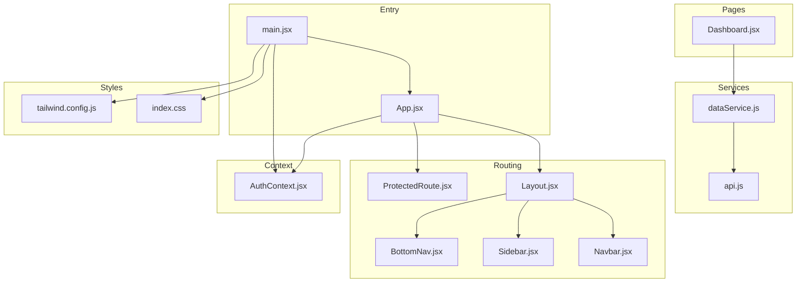
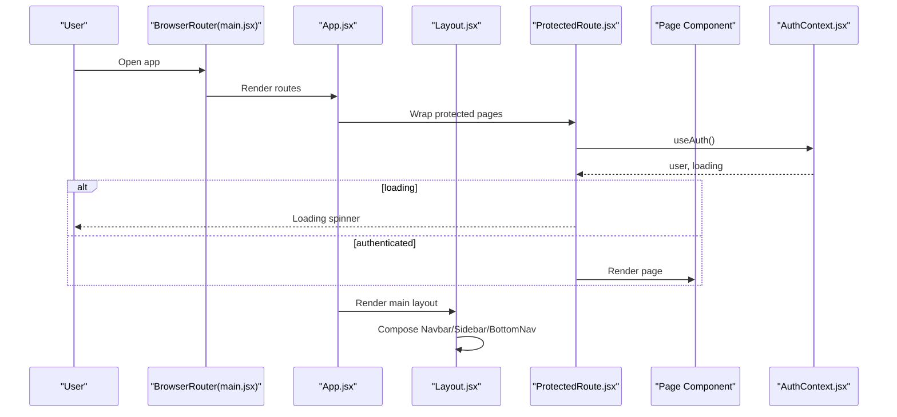
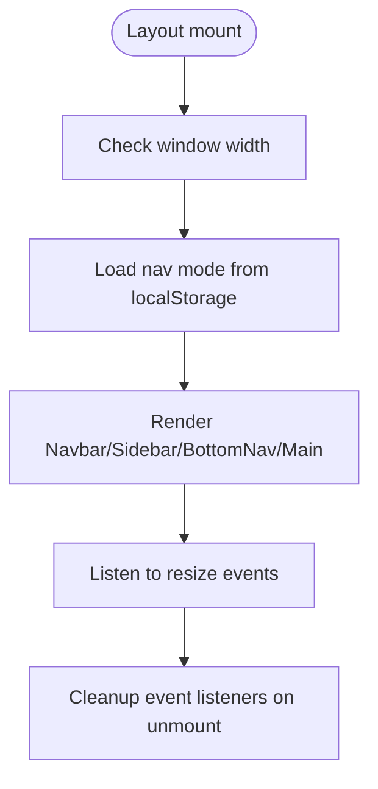
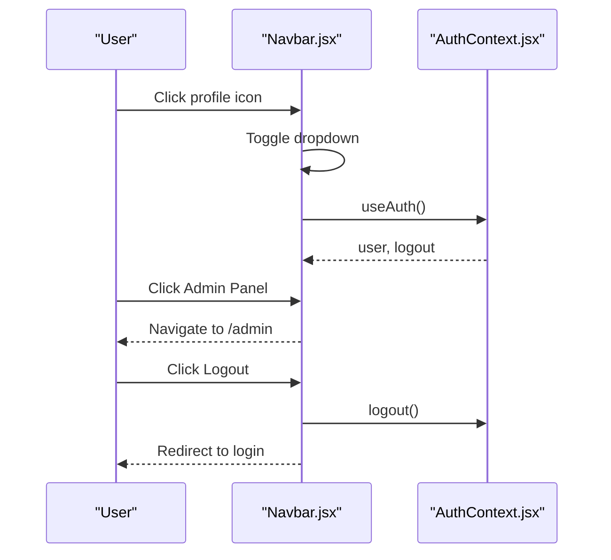
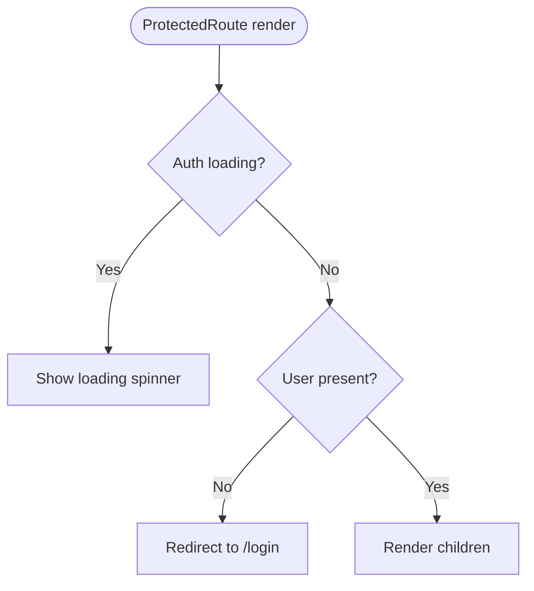
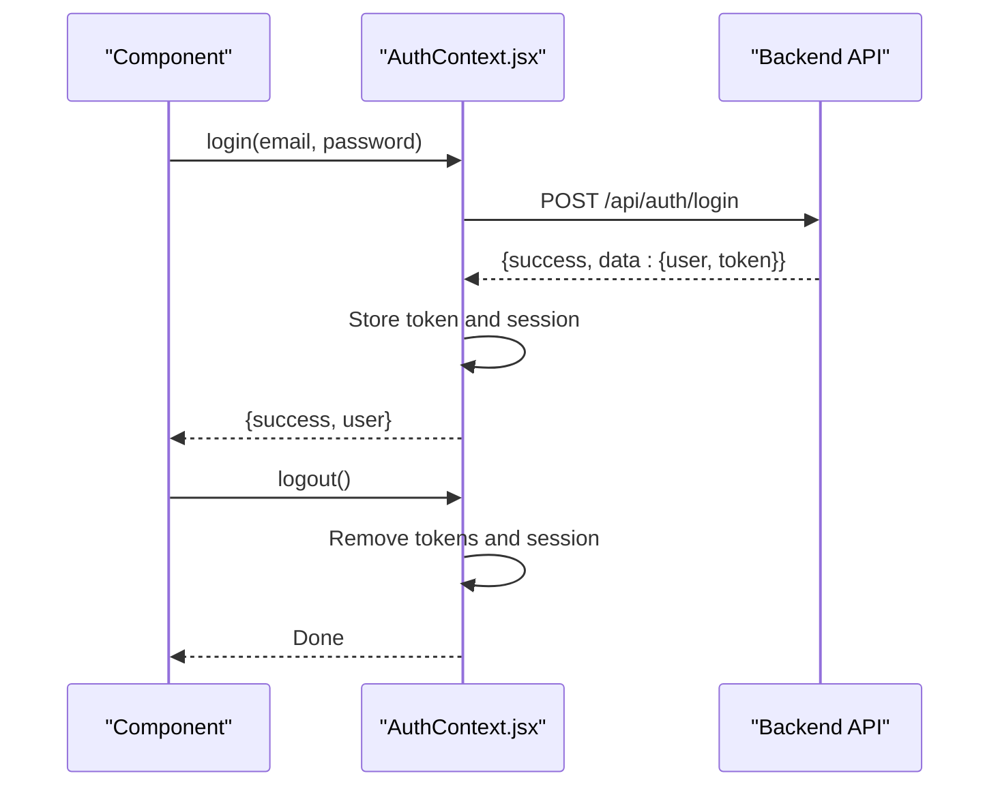
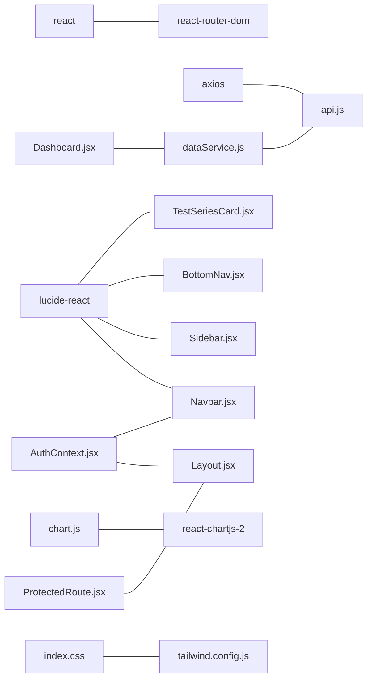

# Frontend Components

<cite>
**Referenced Files in This Document**
- [App.jsx](file://Frontend/src/App.jsx)
- [main.jsx](file://Frontend/src/main.jsx)
- [AuthContext.jsx](file://Frontend/src/context/AuthContext.jsx)
- [ProtectedRoute.jsx](file://Frontend/src/components/auth/ProtectedRoute.jsx)
- [Layout.jsx](file://Frontend/src/components/layout/Layout.jsx)
- [Navbar.jsx](file://Frontend/src/components/layout/Navbar.jsx)
- [Sidebar.jsx](file://Frontend/src/components/layout/Sidebar.jsx)
- [BottomNav.jsx](file://Frontend/src/components/layout/BottomNav.jsx)
- [Breadcrumb.jsx](file://Frontend/src/components/common/Breadcrumb.jsx)
- [TestSeriesCard.jsx](file://Frontend/src/components/test/TestSeriesCard.jsx)
- [HorizontalScroll.jsx](file://Frontend/src/components/common/HorizontalScroll.jsx)
- [Dashboard.jsx](file://Frontend/src/pages/Dashboard.jsx)
- [api.js](file://Frontend/src/services/api.js)
- [dataService.js](file://Frontend/src/services/dataService.js)
- [index.css](file://Frontend/src/styles/index.css)
- [tailwind.config.js](file://Frontend/tailwind.config.js)
- [package.json](file://Frontend/package.json)
</cite>

## Table of Contents
1. [Introduction](#introduction)
2. [Project Structure](#project-structure)
3. [Core Components](#core-components)
4. [Architecture Overview](#architecture-overview)
5. [Detailed Component Analysis](#detailed-component-analysis)
6. [Dependency Analysis](#dependency-analysis)
7. [Performance Considerations](#performance-considerations)
8. [Troubleshooting Guide](#troubleshooting-guide)
9. [Conclusion](#conclusion)
10. [Appendices](#appendices)

## Introduction
This document explains the React component architecture of Trstprep V2’s frontend. It focuses on the main Layout and its child components (Navbar, Sidebar, BottomNav), reusable components (Breadcrumb, HorizontalScroll), specialized components (TestSeriesCard), authentication and protected routes, Context API state management, component lifecycle, styling with TailwindCSS, responsive design, accessibility, testing strategies, performance optimization, and backend integration patterns.

## Project Structure
The frontend is organized by feature and layer:
- Entry point initializes routing, provider, and global styles.
- Routing defines public, authenticated, and admin routes under Layout or AdminLayout.
- Layout composes Navbar, Sidebar, BottomNav, and renders page content via Outlet.
- Reusable components live under common and test folders.
- Services encapsulate API and caching logic.
- Styling leverages TailwindCSS with custom utilities and theme extensions.

**Diagram sources**
- [main.jsx](file://Frontend/src/main.jsx#L1-L17)
- [App.jsx](file://Frontend/src/App.jsx#L1-L143)
- [Layout.jsx](file://Frontend/src/components/layout/Layout.jsx#L1-L87)
- [ProtectedRoute.jsx](file://Frontend/src/components/auth/ProtectedRoute.jsx#L1-L29)
- [Navbar.jsx](file://Frontend/src/components/layout/Navbar.jsx#L1-L217)
- [Sidebar.jsx](file://Frontend/src/components/layout/Sidebar.jsx#L1-L186)
- [BottomNav.jsx](file://Frontend/src/components/layout/BottomNav.jsx#L1-L109)
- [Dashboard.jsx](file://Frontend/src/pages/Dashboard.jsx#L1-L330)
- [api.js](file://Frontend/src/services/api.js#L1-L92)
- [dataService.js](file://Frontend/src/services/dataService.js#L1-L172)
- [AuthContext.jsx](file://Frontend/src/context/AuthContext.jsx#L1-L203)
- [index.css](file://Frontend/src/styles/index.css#L1-L800)
- [tailwind.config.js](file://Frontend/tailwind.config.js#L1-L33)

**Section sources**
- [main.jsx](file://Frontend/src/main.jsx#L1-L17)
- [App.jsx](file://Frontend/src/App.jsx#L1-L143)
- [index.css](file://Frontend/src/styles/index.css#L1-L800)
- [tailwind.config.js](file://Frontend/tailwind.config.js#L1-L33)

## Core Components
- Layout orchestrates the shell: Navbar, Sidebar, BottomNav, and Outlet rendering.
- Navbar handles top navigation, search overlay, notifications, dark mode toggle, and profile actions.
- Sidebar provides a drawer-based navigation for desktop and mobile, with sticky auth area.
- BottomNav offers a mobile-first tab bar with dynamic items based on user role.
- ProtectedRoute enforces authentication for protected pages.
- AuthContext manages user session, login/signup/logout, profile updates, and Pro status checks.
- Breadcrumb renders navigational breadcrumbs with optional home and current page indicators.
- HorizontalScroll wraps horizontally scrollable content with auto-showing arrows and swipe support.
- TestSeriesCard displays a single test series card with stats, tags, and optional progress.
- Dashboard demonstrates composition of cards, lists, and grids with responsive layouts.

**Section sources**
- [Layout.jsx](file://Frontend/src/components/layout/Layout.jsx#L1-L87)
- [Navbar.jsx](file://Frontend/src/components/layout/Navbar.jsx#L1-L217)
- [Sidebar.jsx](file://Frontend/src/components/layout/Sidebar.jsx#L1-L186)
- [BottomNav.jsx](file://Frontend/src/components/layout/BottomNav.jsx#L1-L109)
- [ProtectedRoute.jsx](file://Frontend/src/components/auth/ProtectedRoute.jsx#L1-L29)
- [AuthContext.jsx](file://Frontend/src/context/AuthContext.jsx#L1-L203)
- [Breadcrumb.jsx](file://Frontend/src/components/common/Breadcrumb.jsx#L1-L39)
- [HorizontalScroll.jsx](file://Frontend/src/components/common/HorizontalScroll.jsx#L1-L89)
- [TestSeriesCard.jsx](file://Frontend/src/components/test/TestSeriesCard.jsx#L1-L109)
- [Dashboard.jsx](file://Frontend/src/pages/Dashboard.jsx#L1-L330)

## Architecture Overview
The app uses React Router v6 for declarative routing. Authentication is enforced via ProtectedRoute around sensitive pages. Global state is centralized in AuthContext, consumed by Layout and Navbar. Services abstract API calls and caching. Styling is Tailwind-based with custom theme extensions and animations.

**Diagram sources**
- [main.jsx](file://Frontend/src/main.jsx#L1-L17)
- [App.jsx](file://Frontend/src/App.jsx#L1-L143)
- [ProtectedRoute.jsx](file://Frontend/src/components/auth/ProtectedRoute.jsx#L1-L29)
- [AuthContext.jsx](file://Frontend/src/context/AuthContext.jsx#L1-L203)
- [Layout.jsx](file://Frontend/src/components/layout/Layout.jsx#L1-L87)

## Detailed Component Analysis

### Layout Component
Responsibilities:
- Manages sidebar open state, mobile detection, and navigation mode (top/left).
- Applies responsive classes and transitions.
- Renders Navbar, Sidebar, BottomNav, and Outlet.

Key behaviors:
- Detects mobile viewport and toggles bottom navigation accordingly.
- Persists navigation mode preference in localStorage.
- Uses Tailwind utilities for smooth transitions and desktop left-nav mode.

**Diagram sources**
- [Layout.jsx](file://Frontend/src/components/layout/Layout.jsx#L1-L87)

**Section sources**
- [Layout.jsx](file://Frontend/src/components/layout/Layout.jsx#L1-L87)

### Navbar Component
Responsibilities:
- Renders top navigation links.
- Provides search overlay modal.
- Handles profile dropdown with user info, admin panel link, analytics, settings, and logout.
- Supports dark mode toggle.

Accessibility and UX:
- Uses semantic markup and keyboard-friendly dropdown behavior.
- Conditional rendering based on user role and authentication state.

**Diagram sources**
- [Navbar.jsx](file://Frontend/src/components/layout/Navbar.jsx#L1-L217)
- [AuthContext.jsx](file://Frontend/src/context/AuthContext.jsx#L1-L203)

**Section sources**
- [Navbar.jsx](file://Frontend/src/components/layout/Navbar.jsx#L1-L217)

### Sidebar Component
Responsibilities:
- Renders a slide-in drawer with categorized links (Learning & Tests, Resources, Premium).
- Includes a sticky auth section with user info and quick actions.
- Handles overlay click to close and mobile drawer behavior.

Responsive behavior:
- Uses Tailwind utilities for overlay and drawer transforms.
- Adapts to desktop left-nav mode via parent class.

**Section sources**
- [Sidebar.jsx](file://Frontend/src/components/layout/Sidebar.jsx#L1-L186)

### BottomNav Component
Responsibilities:
- Provides a mobile bottom tab bar with dynamic items.
- Highlights active tab and supports live indicators and admin badges.
- Adapts items based on login state and role.

**Section sources**
- [BottomNav.jsx](file://Frontend/src/components/layout/BottomNav.jsx#L1-L109)

### ProtectedRoute Component
Responsibilities:
- Blocks unauthenticated users with redirect to login.
- Shows a loading state while checking auth.
- Wraps page components for protected routes.

**Diagram sources**
- [ProtectedRoute.jsx](file://Frontend/src/components/auth/ProtectedRoute.jsx#L1-L29)

**Section sources**
- [ProtectedRoute.jsx](file://Frontend/src/components/auth/ProtectedRoute.jsx#L1-L29)

### AuthContext and Authentication Flow
Responsibilities:
- Centralizes authentication state and session persistence.
- Implements login, signup, logout, profile update, and Pro pass checks.
- Integrates with localStorage and backend endpoints.

**Diagram sources**
- [AuthContext.jsx](file://Frontend/src/context/AuthContext.jsx#L1-L203)
- [api.js](file://Frontend/src/services/api.js#L1-L92)

**Section sources**
- [AuthContext.jsx](file://Frontend/src/context/AuthContext.jsx#L1-L203)
- [api.js](file://Frontend/src/services/api.js#L1-L92)

### Breadcrumb Component
Responsibilities:
- Renders breadcrumb navigation with home, intermediate links, and current page.
- Handles optional path resolution from either path or to.

**Section sources**
- [Breadcrumb.jsx](file://Frontend/src/components/common/Breadcrumb.jsx#L1-L39)

### HorizontalScroll Component
Responsibilities:
- Wraps horizontally scrollable content with auto-showing left/right arrows.
- Supports smooth scrolling and touch gestures.
- Hides native scrollbars and adds custom styling.

**Section sources**
- [HorizontalScroll.jsx](file://Frontend/src/components/common/HorizontalScroll.jsx#L1-L89)

### TestSeriesCard Component
Responsibilities:
- Displays a single test series with category, users, rating, test types, totals, and optional progress bar.
- Provides a call-to-action button with animated hover effect.

**Section sources**
- [TestSeriesCard.jsx](file://Frontend/src/components/test/TestSeriesCard.jsx#L1-L109)

### Dashboard Page Composition
Responsibilities:
- Demonstrates composition patterns: welcome banner, quick access grid, recent series, live tests, my exams, recent activity, quick stats, suggested series.
- Uses responsive grid and card layouts with Tailwind utilities.
- Integrates dataService for fetching series and charts for analytics.

**Section sources**
- [Dashboard.jsx](file://Frontend/src/pages/Dashboard.jsx#L1-L330)
- [dataService.js](file://Frontend/src/services/dataService.js#L1-L172)

## Dependency Analysis
External libraries:
- react, react-router-dom for routing and navigation.
- lucide-react for icons.
- axios for HTTP requests.
- chart.js and react-chartjs-2 for analytics visuals.

Internal dependencies:
- AuthContext is provided at the root and consumed by Layout and Navbar.
- ProtectedRoute depends on AuthContext and react-router-dom.
- Pages depend on services for data fetching.
- Styles depend on Tailwind configuration and global CSS.

**Diagram sources**
- [package.json](file://Frontend/package.json#L1-L35)
- [api.js](file://Frontend/src/services/api.js#L1-L92)
- [AuthContext.jsx](file://Frontend/src/context/AuthContext.jsx#L1-L203)
- [Layout.jsx](file://Frontend/src/components/layout/Layout.jsx#L1-L87)
- [Navbar.jsx](file://Frontend/src/components/layout/Navbar.jsx#L1-L217)
- [Sidebar.jsx](file://Frontend/src/components/layout/Sidebar.jsx#L1-L186)
- [BottomNav.jsx](file://Frontend/src/components/layout/BottomNav.jsx#L1-L109)
- [TestSeriesCard.jsx](file://Frontend/src/components/test/TestSeriesCard.jsx#L1-L109)
- [Dashboard.jsx](file://Frontend/src/pages/Dashboard.jsx#L1-L330)
- [dataService.js](file://Frontend/src/services/dataService.js#L1-L172)
- [index.css](file://Frontend/src/styles/index.css#L1-L800)
- [tailwind.config.js](file://Frontend/tailwind.config.js#L1-L33)

**Section sources**
- [package.json](file://Frontend/package.json#L1-L35)
- [api.js](file://Frontend/src/services/api.js#L1-L92)
- [AuthContext.jsx](file://Frontend/src/context/AuthContext.jsx#L1-L203)

## Performance Considerations
- Caching: dataService caches fetched resources for short durations to reduce redundant network calls.
- Lazy loading: Consider lazy-loading heavy pages (e.g., TestInterface) to improve initial load.
- Virtualization: For long lists, implement virtualized lists to limit DOM nodes.
- Event cleanup: Layout and HorizontalScroll properly attach and detach event listeners.
- CSS: Prefer Tailwind utilities to avoid runtime style computations; keep global CSS minimal.
- Images and assets: Optimize images and defer non-critical assets.

[No sources needed since this section provides general guidance]

## Troubleshooting Guide
Common issues and resolutions:
- Authentication redirects loop: Verify AuthContext session validity and localStorage keys. Ensure ProtectedRoute handles loading state.
- Sidebar not closing: Confirm overlay click handler and closeSidebar prop are passed correctly.
- Mobile bottom nav missing: Ensure Layout conditionally renders BottomNav only on mobile.
- API errors: Check axios interceptors for 401 handling and token presence.
- Styling inconsistencies: Validate Tailwind configuration and ensure index.css is imported.

**Section sources**
- [ProtectedRoute.jsx](file://Frontend/src/components/auth/ProtectedRoute.jsx#L1-L29)
- [Layout.jsx](file://Frontend/src/components/layout/Layout.jsx#L1-L87)
- [api.js](file://Frontend/src/services/api.js#L1-L92)
- [index.css](file://Frontend/src/styles/index.css#L1-L800)

## Conclusion
Trstprep V2’s frontend follows a clean, layered architecture with a central Layout shell, reusable UI components, robust authentication via Context API, and service abstractions for data and API access. TailwindCSS provides consistent styling and responsive behavior. The design emphasizes composability, accessibility, and performance through caching and lifecycle cleanup.

[No sources needed since this section summarizes without analyzing specific files]

## Appendices

### Component Lifecycle Management
- Mounting: AuthContext checks stored sessions; Layout detects mobile and loads preferences; HorizontalScroll sets arrow visibility.
- Updates: Layout listens to resize; Navbar manages dropdown state; Sidebar and BottomNav respond to user actions.
- Unmounting: Cleanup event listeners in Layout and HorizontalScroll to prevent memory leaks.

**Section sources**
- [Layout.jsx](file://Frontend/src/components/layout/Layout.jsx#L1-L87)
- [HorizontalScroll.jsx](file://Frontend/src/components/common/HorizontalScroll.jsx#L1-L89)

### Styling Approaches and Responsive Design
- Tailwind utilities for spacing, colors, shadows, and responsive breakpoints.
- Custom theme extensions for brand colors and shadows.
- Global animations and component-specific styles for transitions and overlays.
- Responsive grids and flexible containers for dashboard and cards.

**Section sources**
- [index.css](file://Frontend/src/styles/index.css#L1-L800)
- [tailwind.config.js](file://Frontend/tailwind.config.js#L1-L33)
- [Dashboard.jsx](file://Frontend/src/pages/Dashboard.jsx#L1-L330)

### Accessibility Considerations
- Semantic HTML and proper labeling for buttons and modals.
- Focus management for dropdowns and overlays.
- Keyboard navigation support for menus and drawers.
- ARIA attributes for screen readers (e.g., aria-labels on scroll arrows).

[No sources needed since this section provides general guidance]

### Testing Strategies
- Unit tests for pure functions (e.g., dataService helpers).
- Component tests for interactive UI (e.g., Navbar dropdown, HorizontalScroll arrows).
- Integration tests for ProtectedRoute and AuthContext flows.
- E2E tests for critical journeys (login → protected page → logout).

[No sources needed since this section provides general guidance]

### Backend Integration Patterns
- Centralized API client with interceptors for auth tokens and error handling.
- Service layer abstracts endpoints and caching policies.
- Pages consume services for data fetching and pass props downstream.

**Section sources**
- [api.js](file://Frontend/src/services/api.js#L1-L92)
- [dataService.js](file://Frontend/src/services/dataService.js#L1-L172)
- [Dashboard.jsx](file://Frontend/src/pages/Dashboard.jsx#L1-L330)

*Last Updated: March 10, 2026 | Update date is (20:16)*
