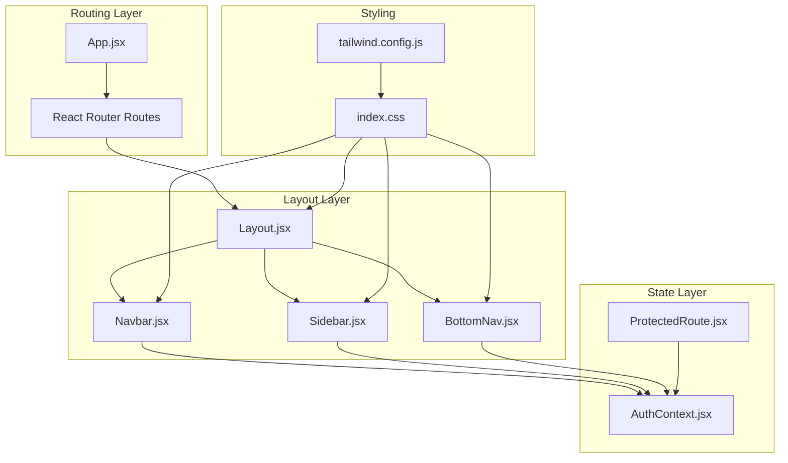
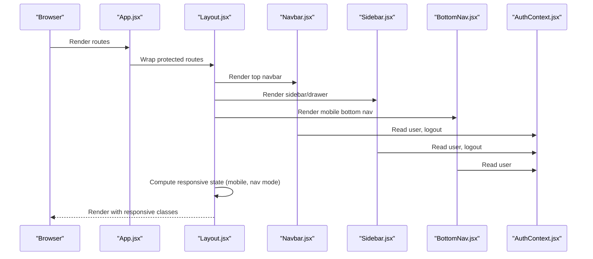
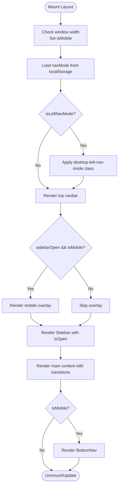
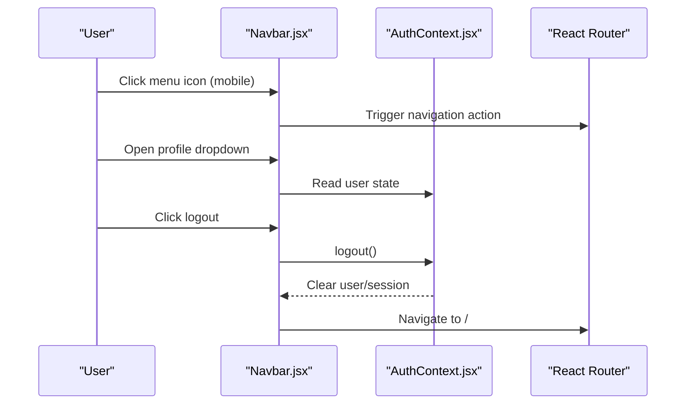
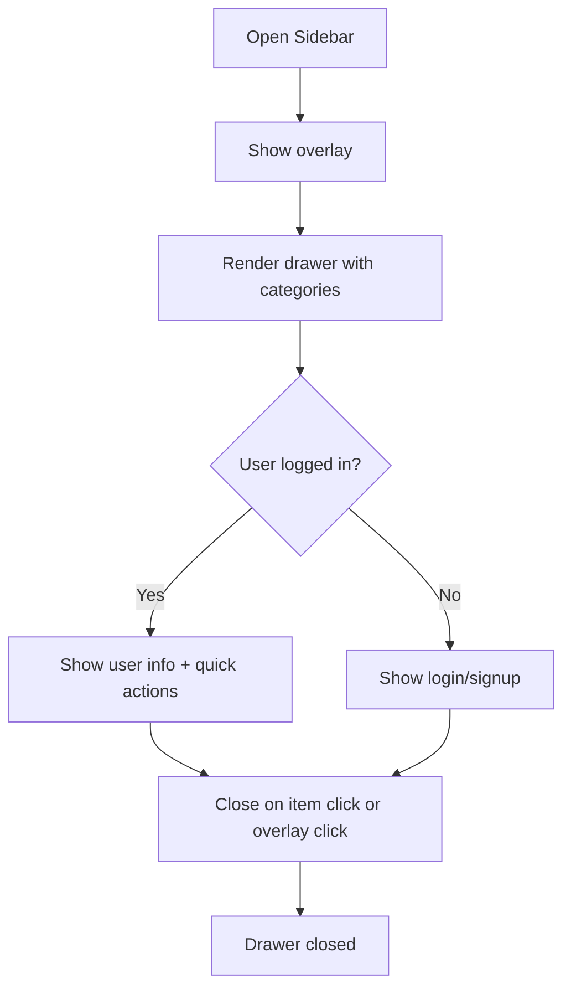
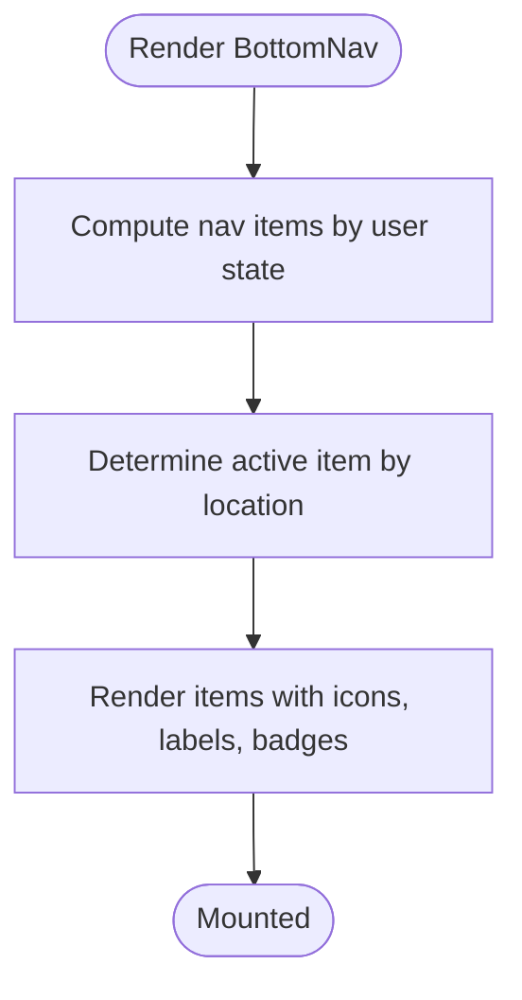
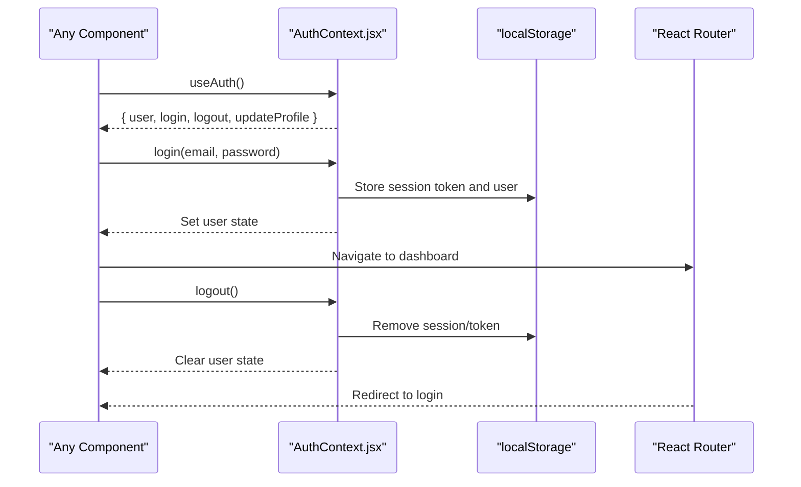
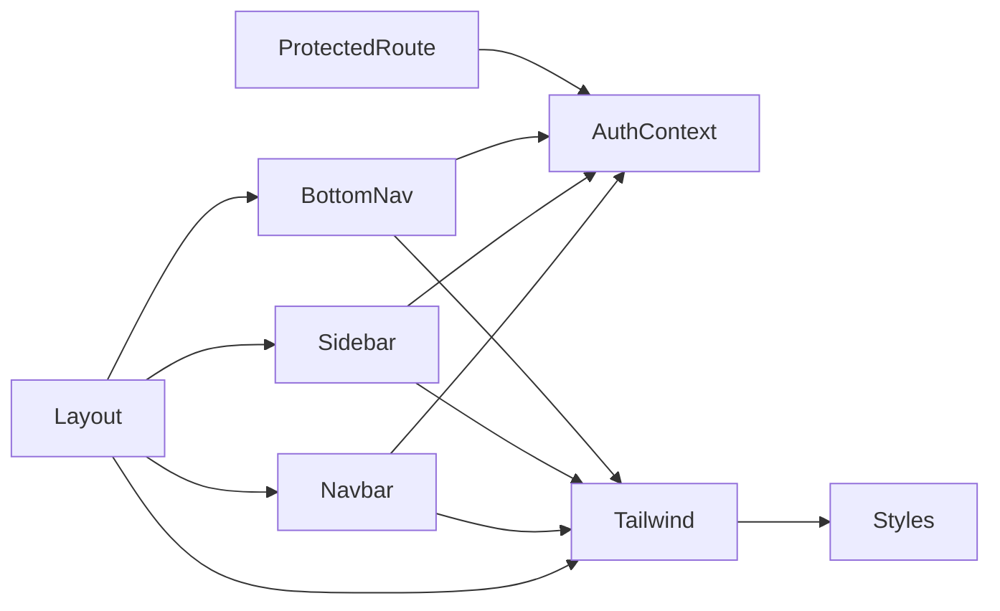

# Layout Components

<cite>
**Referenced Files in This Document**
- [Layout.jsx](file://Frontend/src/components/layout/Layout.jsx)
- [Navbar.jsx](file://Frontend/src/components/layout/Navbar.jsx)
- [Sidebar.jsx](file://Frontend/src/components/layout/Sidebar.jsx)
- [BottomNav.jsx](file://Frontend/src/components/layout/BottomNav.jsx)
- [AuthContext.jsx](file://Frontend/src/context/AuthContext.jsx)
- [ProtectedRoute.jsx](file://Frontend/src/components/auth/ProtectedRoute.jsx)
- [App.jsx](file://Frontend/src/App.jsx)
- [main.jsx](file://Frontend/src/main.jsx)
- [index.css](file://Frontend/src/styles/index.css)
- [tailwind.config.js](file://Frontend/tailwind.config.js)
</cite>

## Table of Contents
1. [Introduction](#introduction)
2. [Project Structure](#project-structure)
3. [Core Components](#core-components)
4. [Architecture Overview](#architecture-overview)
5. [Detailed Component Analysis](#detailed-component-analysis)
6. [Dependency Analysis](#dependency-analysis)
7. [Performance Considerations](#performance-considerations)
8. [Troubleshooting Guide](#troubleshooting-guide)
9. [Conclusion](#conclusion)

## Introduction
This document explains Trstprep V2’s layout component system with a focus on responsive navigation modes, mobile overlays, and sidebar management. It covers the main Layout component, Navbar with authentication integration, Sidebar for desktop/mobile navigation, and BottomNav for mobile-first patterns. It also documents component composition, prop drilling strategies, Context API state management, TailwindCSS responsive design, and accessibility considerations.

## Project Structure
The layout system lives under the frontend application and integrates with routing and authentication contexts:
- Layout orchestrates responsive navigation modes, mobile overlays, and sidebar/desktop behavior.
- Navbar handles desktop links, search, notifications, dark mode, and user profile actions.
- Sidebar manages mobile drawer and desktop left navigation.
- BottomNav provides a mobile-first tab bar with role-aware items.
- AuthContext provides authentication state and actions to all components.
- ProtectedRoute enforces authentication for protected pages.
- TailwindCSS and global styles define responsive behavior and animations.

**Diagram sources**
- [App.jsx](file://Frontend/src/App.jsx#L62-L139)
- [Layout.jsx](file://Frontend/src/components/layout/Layout.jsx#L8-L87)
- [Navbar.jsx](file://Frontend/src/components/layout/Navbar.jsx#L6-L217)
- [Sidebar.jsx](file://Frontend/src/components/layout/Sidebar.jsx#L5-L186)
- [BottomNav.jsx](file://Frontend/src/components/layout/BottomNav.jsx#L5-L109)
- [AuthContext.jsx](file://Frontend/src/context/AuthContext.jsx#L13-L203)
- [ProtectedRoute.jsx](file://Frontend/src/components/auth/ProtectedRoute.jsx#L4-L29)
- [tailwind.config.js](file://Frontend/tailwind.config.js#L1-L33)
- [index.css](file://Frontend/src/styles/index.css#L1-L1348)

**Section sources**
- [App.jsx](file://Frontend/src/App.jsx#L62-L139)
- [main.jsx](file://Frontend/src/main.jsx#L8-L16)
- [tailwind.config.js](file://Frontend/tailwind.config.js#L1-L33)
- [index.css](file://Frontend/src/styles/index.css#L1-L1348)

## Core Components
- Layout: Central orchestrator for responsive navigation modes, mobile overlay, sidebar, and main content area. Manages state for sidebar open/close, mobile detection, and navigation mode persistence.
- Navbar: Desktop navigation links, search overlay, notifications, dark mode toggle, and user profile dropdown with authentication-aware actions.
- Sidebar: Mobile drawer with categorized navigation and authentication controls; also adapts to desktop left navigation mode.
- BottomNav: Mobile-first bottom tab bar with role-aware items and live indicators.
- AuthContext: Provides user state, login/signup/logout/updateProfile, and authentication helpers to all components.
- ProtectedRoute: Guards protected routes and redirects unauthenticated users to login.

**Section sources**
- [Layout.jsx](file://Frontend/src/components/layout/Layout.jsx#L8-L87)
- [Navbar.jsx](file://Frontend/src/components/layout/Navbar.jsx#L6-L217)
- [Sidebar.jsx](file://Frontend/src/components/layout/Sidebar.jsx#L5-L186)
- [BottomNav.jsx](file://Frontend/src/components/layout/BottomNav.jsx#L5-L109)
- [AuthContext.jsx](file://Frontend/src/context/AuthContext.jsx#L13-L203)
- [ProtectedRoute.jsx](file://Frontend/src/components/auth/ProtectedRoute.jsx#L4-L29)

## Architecture Overview
The layout system follows a composition pattern:
- App defines routes and wraps protected routes with authentication guards.
- Layout composes Navbar, Sidebar, BottomNav, and Outlet for content.
- Navbar and Sidebar consume AuthContext for user state and actions.
- Layout coordinates responsive behavior and state transitions.

**Diagram sources**
- [App.jsx](file://Frontend/src/App.jsx#L62-L139)
- [Layout.jsx](file://Frontend/src/components/layout/Layout.jsx#L43-L82)
- [Navbar.jsx](file://Frontend/src/components/layout/Navbar.jsx#L6-L217)
- [Sidebar.jsx](file://Frontend/src/components/layout/Sidebar.jsx#L5-L186)
- [BottomNav.jsx](file://Frontend/src/components/layout/BottomNav.jsx#L5-L109)
- [AuthContext.jsx](file://Frontend/src/context/AuthContext.jsx#L13-L203)

## Detailed Component Analysis

### Layout Component
Responsibilities:
- Detects mobile viewport and persists navigation mode preference.
- Controls sidebar open/close state and applies responsive classes.
- Switches between top and left navigation modes.
- Renders mobile overlay and bottom navigation conditionally.

Key behaviors:
- Mobile detection via resize listener.
- Navigation mode persisted in localStorage.
- Conditional rendering of mobile overlay and bottom nav.
- Left navigation mode adds a desktop-left-nav-mode class to enable sidebar.

Responsive and state management:
- Uses useState for sidebarOpen, isMobile, and navMode.
- Persists navMode to localStorage and reads on mount.
- Applies Tailwind classes for left navigation and bottom nav spacing.

Accessibility:
- Uses semantic class names for screen reader-friendly structure.
- Ensures focus and keyboard navigation compatibility through standard HTML elements.

**Diagram sources**
- [Layout.jsx](file://Frontend/src/components/layout/Layout.jsx#L14-L82)
- [index.css](file://Frontend/src/styles/index.css#L254-L341)

**Section sources**
- [Layout.jsx](file://Frontend/src/components/layout/Layout.jsx#L8-L87)
- [index.css](file://Frontend/src/styles/index.css#L254-L341)

### Navbar Component
Responsibilities:
- Displays desktop navigation links with active state detection.
- Provides search overlay with escape behavior.
- Integrates authentication: notifications, dark mode toggle, profile dropdown.
- Handles logout and admin panel access.

Authentication integration:
- Reads user from AuthContext.
- Shows login/signup buttons when user is null.
- Shows profile dropdown with user info, admin panel link (admin role), analytics, settings, and logout.

Mobile/desktop behavior:
- Hides desktop links on mobile and shows hamburger menu.
- Uses Tailwind responsive classes to switch layouts.

Accessibility:
- Uses semantic elements (button, div, Link).
- Dropdown toggled via click events; click-outside closes dropdown.

**Diagram sources**
- [Navbar.jsx](file://Frontend/src/components/layout/Navbar.jsx#L6-L217)
- [AuthContext.jsx](file://Frontend/src/context/AuthContext.jsx#L13-L203)

**Section sources**
- [Navbar.jsx](file://Frontend/src/components/layout/Navbar.jsx#L6-L217)
- [AuthContext.jsx](file://Frontend/src/context/AuthContext.jsx#L13-L203)

### Sidebar Component
Responsibilities:
- Mobile drawer with overlay and close button.
- Categorized navigation for learning/tests, resources, and premium.
- Authentication section with user info and quick actions.

Desktop adaptation:
- In left navigation mode, transforms into a persistent left sidebar.
- Uses Tailwind responsive classes to hide/show based on mode and viewport.

Authentication integration:
- Shows login/signup buttons when user is null.
- Shows user info and logout when authenticated.

Accessibility:
- Uses semantic elements and keyboard-accessible links.
- Overlay click closes drawer.

**Diagram sources**
- [Sidebar.jsx](file://Frontend/src/components/layout/Sidebar.jsx#L5-L186)
- [index.css](file://Frontend/src/styles/index.css#L254-L341)

**Section sources**
- [Sidebar.jsx](file://Frontend/src/components/layout/Sidebar.jsx#L5-L186)
- [index.css](file://Frontend/src/styles/index.css#L254-L341)

### BottomNav Component
Responsibilities:
- Mobile-first bottom tab bar with five items.
- Role-aware items: admin vs. regular user vs. guest.
- Live indicator dots for live tests.
- Active state highlighting and subtle animations.

Behavior:
- Computes items based on authentication state and role.
- Uses isActive to highlight current route.
- Integrates safe-area insets for modern devices.

Accessibility:
- Uses semantic anchor elements for navigation.
- Active state indicated via visual cues.

**Diagram sources**
- [BottomNav.jsx](file://Frontend/src/components/layout/BottomNav.jsx#L5-L109)

**Section sources**
- [BottomNav.jsx](file://Frontend/src/components/layout/BottomNav.jsx#L5-L109)

### AuthContext and ProtectedRoute
Responsibilities:
- AuthContext: Manages user session, login/logout, and profile updates; persists session in localStorage.
- ProtectedRoute: Guards routes requiring authentication and shows loading state during auth check.

Integration:
- All layout components consume AuthContext for user state and actions.
- ProtectedRoute ensures only authenticated users can access protected pages.

**Diagram sources**
- [AuthContext.jsx](file://Frontend/src/context/AuthContext.jsx#L13-L203)
- [ProtectedRoute.jsx](file://Frontend/src/components/auth/ProtectedRoute.jsx#L4-L29)

**Section sources**
- [AuthContext.jsx](file://Frontend/src/context/AuthContext.jsx#L13-L203)
- [ProtectedRoute.jsx](file://Frontend/src/components/auth/ProtectedRoute.jsx#L4-L29)

## Dependency Analysis
- Layout depends on Navbar, Sidebar, BottomNav, and Outlet.
- Navbar, Sidebar, BottomNav depend on AuthContext for user state and actions.
- ProtectedRoute depends on AuthContext for authentication checks.
- TailwindCSS and index.css define responsive classes and animations used by components.

**Diagram sources**
- [Layout.jsx](file://Frontend/src/components/layout/Layout.jsx#L3-L6)
- [Navbar.jsx](file://Frontend/src/components/layout/Navbar.jsx#L4)
- [Sidebar.jsx](file://Frontend/src/components/layout/Sidebar.jsx#L3)
- [BottomNav.jsx](file://Frontend/src/components/layout/BottomNav.jsx#L3)
- [AuthContext.jsx](file://Frontend/src/context/AuthContext.jsx#L1-L4)
- [ProtectedRoute.jsx](file://Frontend/src/components/auth/ProtectedRoute.jsx#L2)
- [tailwind.config.js](file://Frontend/tailwind.config.js#L1-L33)
- [index.css](file://Frontend/src/styles/index.css#L1-L1348)

**Section sources**
- [Layout.jsx](file://Frontend/src/components/layout/Layout.jsx#L3-L6)
- [Navbar.jsx](file://Frontend/src/components/layout/Navbar.jsx#L4)
- [Sidebar.jsx](file://Frontend/src/components/layout/Sidebar.jsx#L3)
- [BottomNav.jsx](file://Frontend/src/components/layout/BottomNav.jsx#L3)
- [AuthContext.jsx](file://Frontend/src/context/AuthContext.jsx#L1-L4)
- [ProtectedRoute.jsx](file://Frontend/src/components/auth/ProtectedRoute.jsx#L2)
- [tailwind.config.js](file://Frontend/tailwind.config.js#L1-L33)
- [index.css](file://Frontend/src/styles/index.css#L1-L1348)

## Performance Considerations
- Mobile detection uses a single resize listener attached on mount and cleaned up on unmount.
- Navigation mode is persisted to localStorage to avoid repeated reads.
- Sidebar drawer and overlay use CSS transforms and transitions for smooth animations.
- BottomNav items are computed once per render based on user state.
- AuthContext stores sessions in localStorage to avoid repeated network calls on mount.

[No sources needed since this section provides general guidance]

## Troubleshooting Guide
Common issues and resolutions:
- Navigation mode not persisting: Verify localStorage key and write/read logic in Layout.
- Sidebar not closing on mobile: Ensure overlay click handler and close function are wired correctly.
- BottomNav items incorrect: Confirm user state and role are correctly passed to BottomNav.
- Authentication state not updating: Check AuthContext providers and ProtectedRoute guards.
- Responsive classes not applying: Verify Tailwind breakpoints and CSS class names in Layout and styles.

**Section sources**
- [Layout.jsx](file://Frontend/src/components/layout/Layout.jsx#L24-L42)
- [Sidebar.jsx](file://Frontend/src/components/layout/Sidebar.jsx#L16-L18)
- [BottomNav.jsx](file://Frontend/src/components/layout/BottomNav.jsx#L9-L46)
- [AuthContext.jsx](file://Frontend/src/context/AuthContext.jsx#L13-L40)
- [ProtectedRoute.jsx](file://Frontend/src/components/auth/ProtectedRoute.jsx#L4-L29)
- [index.css](file://Frontend/src/styles/index.css#L254-L341)

## Conclusion
Trstprep V2’s layout system combines a central Layout component with Navbar, Sidebar, and BottomNav to deliver a responsive, authenticated navigation experience. State is centralized via AuthContext, and ProtectedRoute ensures secure access to protected areas. TailwindCSS and custom CSS classes implement responsive behavior and animations. The system balances desktop and mobile experiences while maintaining accessibility and performance.

*Last Updated: March 10, 2026 | Update date is (20:16)*
