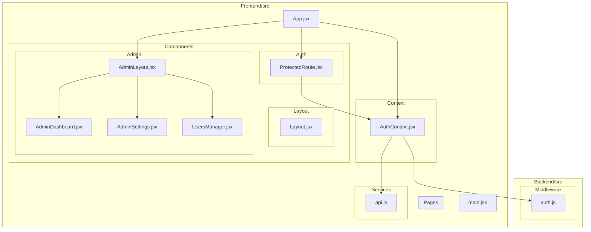
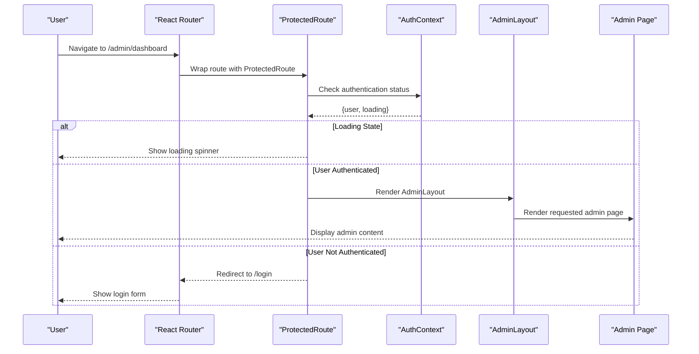
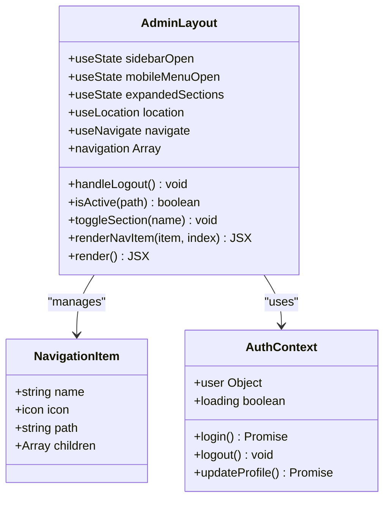
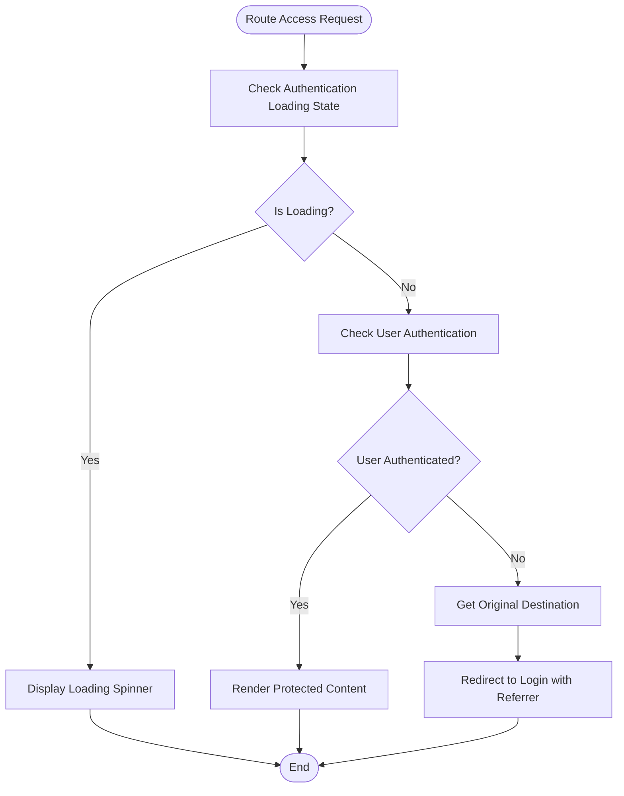
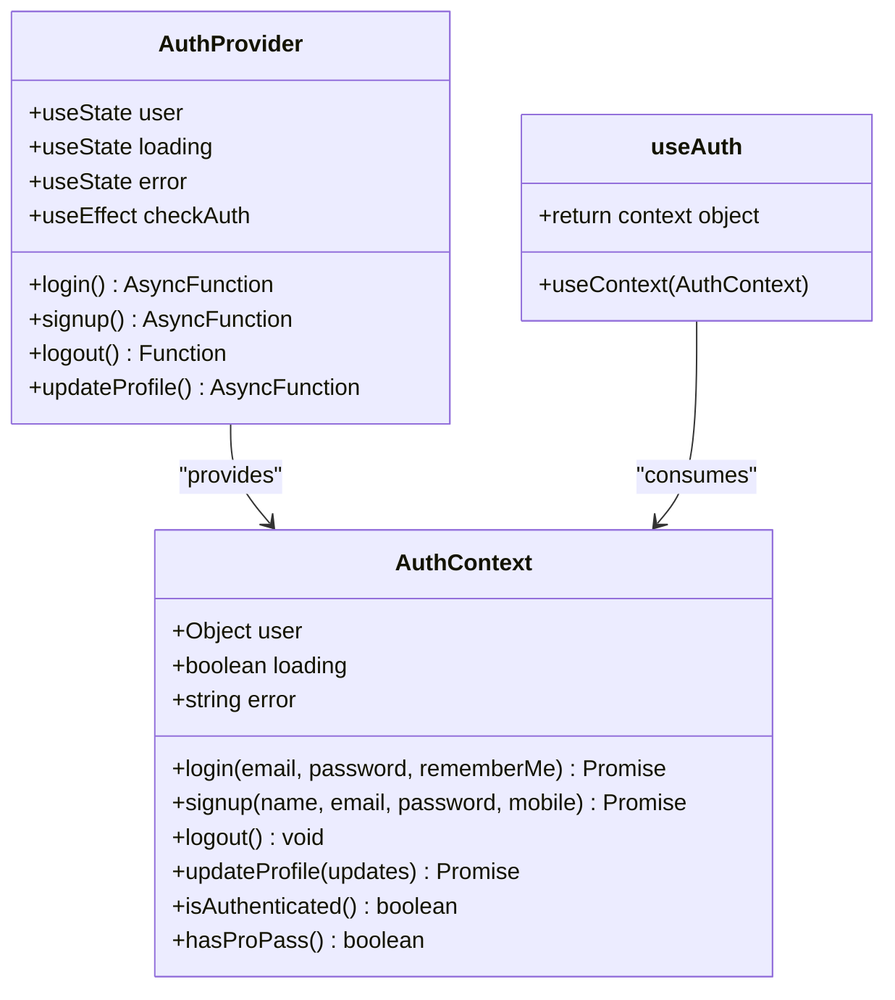
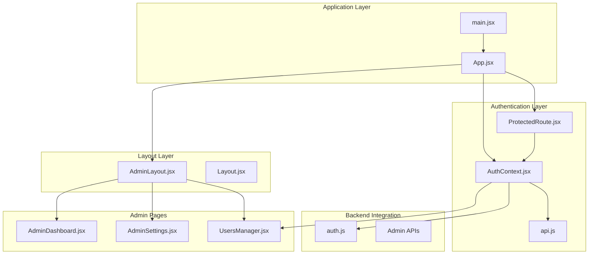

# Specialized Functional Components

<cite>
**Referenced Files in This Document**
- [AdminLayout.jsx](file://Frontend/src/components/admin/AdminLayout.jsx)
- [ProtectedRoute.jsx](file://Frontend/src/components/auth/ProtectedRoute.jsx)
- [AuthContext.jsx](file://Frontend/src/context/AuthContext.jsx)
- [App.jsx](file://Frontend/src/App.jsx)
- [main.jsx](file://Frontend/src/main.jsx)
- [AdminDashboard.jsx](file://Frontend/src/pages/admin/AdminDashboard.jsx)
- [AdminSettings.jsx](file://Frontend/src/pages/admin/AdminSettings.jsx)
- [UsersManager.jsx](file://Frontend/src/pages/admin/UsersManager.jsx)
- [api.js](file://Frontend/src/services/api.js)
- [Layout.jsx](file://Frontend/src/components/layout/Layout.jsx)
- [auth.js](file://Backend/src/middleware/auth.js)
</cite>

## Table of Contents
1. [Introduction](#introduction)
2. [Project Structure](#project-structure)
3. [Core Components](#core-components)
4. [Architecture Overview](#architecture-overview)
5. [Detailed Component Analysis](#detailed-component-analysis)
6. [Dependency Analysis](#dependency-analysis)
7. [Performance Considerations](#performance-considerations)
8. [Troubleshooting Guide](#troubleshooting-guide)
9. [Conclusion](#conclusion)

## Introduction
This document provides comprehensive documentation for Trstprep V2's specialized functional components that serve specific application domains. The focus areas include the AdminLayout component for administrative interface organization, the ProtectedRoute component for authentication gating, and the integration patterns that enable secure, role-aware administration capabilities. These components work together to provide a robust administrative experience with proper authentication, authorization, and responsive navigation patterns.

## Project Structure
The specialized components are organized within the Frontend/src architecture, with clear separation between authentication, layout, and administrative functionality:

**Diagram sources**
- [AdminLayout.jsx](file://Frontend/src/components/admin/AdminLayout.jsx#L1-L306)
- [ProtectedRoute.jsx](file://Frontend/src/components/auth/ProtectedRoute.jsx#L1-L29)
- [AuthContext.jsx](file://Frontend/src/context/AuthContext.jsx#L1-L203)
- [App.jsx](file://Frontend/src/App.jsx#L1-L143)
- [main.jsx](file://Frontend/src/main.jsx#L1-L17)

**Section sources**
- [AdminLayout.jsx](file://Frontend/src/components/admin/AdminLayout.jsx#L1-L306)
- [ProtectedRoute.jsx](file://Frontend/src/components/auth/ProtectedRoute.jsx#L1-L29)
- [AuthContext.jsx](file://Frontend/src/context/AuthContext.jsx#L1-L203)
- [App.jsx](file://Frontend/src/App.jsx#L1-L143)
- [main.jsx](file://Frontend/src/main.jsx#L1-L17)

## Core Components
This section examines the two primary specialized components and their roles in the application ecosystem.

### AdminLayout Component
The AdminLayout component serves as the foundational administrative interface wrapper, providing comprehensive navigation, responsive design, and integrated user management capabilities.

Key characteristics:
- **Responsive Design**: Desktop sidebar with collapsible sections and mobile-friendly bottom navigation
- **Hierarchical Navigation**: Nested menu structure with expandable sections for test management
- **Dynamic State Management**: Automatic route-based highlighting and mobile menu handling
- **Integrated User Experience**: Built-in logout functionality and user profile display

### ProtectedRoute Component
The ProtectedRoute component implements authentication gating for sensitive routes, providing seamless user experience during authentication validation and redirection.

Key characteristics:
- **Authentication Validation**: Real-time user state checking with loading indicators
- **Smart Redirection**: Preserves original destination URL for seamless user experience
- **Loading States**: Graceful handling of authentication verification delays
- **Conditional Rendering**: Transparent wrapper that either renders protected content or redirects

**Section sources**
- [AdminLayout.jsx](file://Frontend/src/components/admin/AdminLayout.jsx#L8-L306)
- [ProtectedRoute.jsx](file://Frontend/src/components/auth/ProtectedRoute.jsx#L4-L29)

## Architecture Overview
The specialized components integrate through a layered architecture that separates concerns while maintaining tight coupling for essential functionality:

**Diagram sources**
- [ProtectedRoute.jsx](file://Frontend/src/components/auth/ProtectedRoute.jsx#L4-L29)
- [AuthContext.jsx](file://Frontend/src/context/AuthContext.jsx#L13-L40)
- [AdminLayout.jsx](file://Frontend/src/components/admin/AdminLayout.jsx#L8-L306)
- [App.jsx](file://Frontend/src/App.jsx#L119-L134)

The architecture demonstrates several key patterns:
- **Higher-Order Component Pattern**: ProtectedRoute wraps child components transparently
- **Context API Integration**: Authentication state shared across component hierarchy
- **Layout Composition**: AdminLayout provides consistent administrative interface
- **Route Protection**: Centralized authentication enforcement at routing level

## Detailed Component Analysis

### AdminLayout Component Analysis
The AdminLayout component implements a sophisticated administrative interface with comprehensive navigation and responsive design capabilities.

#### Navigation Architecture
The component maintains a hierarchical navigation structure with dynamic expansion capabilities:

**Diagram sources**
- [AdminLayout.jsx](file://Frontend/src/components/admin/AdminLayout.jsx#L8-L125)
- [AuthContext.jsx](file://Frontend/src/context/AuthContext.jsx#L13-L192)

#### Responsive Design Implementation
The component implements a dual-navigation strategy:

1. **Desktop Navigation**: Collapsible sidebar with icon-only mode for compact display
2. **Mobile Navigation**: Slide-out drawer with bottom navigation bar for touch interaction
3. **Automatic Adaptation**: Route-based highlighting and mobile overlay management

#### Permission-Based Rendering Strategy
The navigation system dynamically adapts based on user role and context:

- **Role Detection**: User role validation through authentication context
- **Conditional Visibility**: Administrative features only appear for authorized users
- **Dynamic State**: Navigation state persists across route changes and device orientation

**Section sources**
- [AdminLayout.jsx](file://Frontend/src/components/admin/AdminLayout.jsx#L31-L47)
- [AdminLayout.jsx](file://Frontend/src/components/admin/AdminLayout.jsx#L69-L125)
- [AdminLayout.jsx](file://Frontend/src/components/admin/AdminLayout.jsx#L127-L306)

### ProtectedRoute Component Analysis
The ProtectedRoute component implements a robust authentication gating mechanism with comprehensive error handling and user experience considerations.

#### Authentication Flow Implementation

**Diagram sources**
- [ProtectedRoute.jsx](file://Frontend/src/components/auth/ProtectedRoute.jsx#L4-L29)

#### Component Composition Patterns
The ProtectedRoute component exemplifies several advanced React patterns:

- **Higher-Order Component Pattern**: Wraps child components transparently
- **Hook Composition**: Integrates with custom AuthContext for state management
- **Conditional Rendering**: Dynamic content based on authentication state
- **State Preservation**: Maintains original route information for seamless redirection

#### Error Handling and Edge Cases
The component handles various edge cases gracefully:
- **Loading States**: Prevents premature rendering during authentication verification
- **Session Expiration**: Automatically redirects unauthenticated users
- **Navigation Preservation**: Maintains user intent through referrer state

**Section sources**
- [ProtectedRoute.jsx](file://Frontend/src/components/auth/ProtectedRoute.jsx#L4-L29)
- [AuthContext.jsx](file://Frontend/src/context/AuthContext.jsx#L13-L40)

### Context API Integration
The specialized components leverage the Context API for centralized state management and cross-component communication.

#### AuthContext Implementation
The AuthContext provides comprehensive authentication state management:

**Diagram sources**
- [AuthContext.jsx](file://Frontend/src/context/AuthContext.jsx#L13-L192)
- [AuthContext.jsx](file://Frontend/src/context/AuthContext.jsx#L194-L203)

#### Session Management Strategy
The context implements sophisticated session management:
- **Local Storage Persistence**: Secure token and session storage
- **Automatic Session Validation**: Periodic session expiry checking
- **Cross-Tab Synchronization**: Consistent state across browser tabs
- **Error Recovery**: Graceful handling of corrupted or expired sessions

**Section sources**
- [AuthContext.jsx](file://Frontend/src/context/AuthContext.jsx#L13-L40)
- [AuthContext.jsx](file://Frontend/src/context/AuthContext.jsx#L43-L98)
- [AuthContext.jsx](file://Frontend/src/context/AuthContext.jsx#L142-L147)

## Dependency Analysis
The specialized components exhibit well-defined dependencies that support maintainability and scalability:

**Diagram sources**
- [App.jsx](file://Frontend/src/App.jsx#L1-L143)
- [AuthContext.jsx](file://Frontend/src/context/AuthContext.jsx#L1-L203)
- [AdminLayout.jsx](file://Frontend/src/components/admin/AdminLayout.jsx#L1-L306)
- [api.js](file://Frontend/src/services/api.js#L1-L92)
- [auth.js](file://Backend/src/middleware/auth.js#L47-L91)

### Component Coupling Analysis
The dependency structure demonstrates optimal coupling patterns:
- **Low Coupling**: Components depend primarily on context and props
- **High Cohesion**: Each component has a focused responsibility
- **Clear Interfaces**: Well-defined prop and context contracts
- **Minimal Circular Dependencies**: No circular import chains detected

### Integration Points
Key integration points facilitate seamless component interaction:
- **Context Provider**: Centralized authentication state management
- **Router Integration**: ProtectedRoute integrates with React Router
- **API Layer**: Shared service layer for backend communication
- **Layout Composition**: AdminLayout provides consistent administrative interface

**Section sources**
- [App.jsx](file://Frontend/src/App.jsx#L40-L134)
- [AuthContext.jsx](file://Frontend/src/context/AuthContext.jsx#L13-L192)
- [AdminLayout.jsx](file://Frontend/src/components/admin/AdminLayout.jsx#L1-L306)

## Performance Considerations
The specialized components implement several performance optimization strategies:

### Lazy Loading and Code Splitting
- **Route-based Loading**: ProtectedRoute displays loading states during authentication checks
- **Component-level Optimization**: AdminLayout uses efficient state management for navigation
- **Memory Management**: Proper cleanup of event listeners and timers

### State Management Efficiency
- **Selective Re-rendering**: Context updates trigger minimal re-renders
- **State Normalization**: User data structured for optimal access patterns
- **Storage Optimization**: Efficient local storage usage with expiration handling

### Network Performance
- **API Interceptors**: Centralized request/response handling reduces duplication
- **Error Caching**: Failed requests handled gracefully without repeated attempts
- **Connection Pooling**: Shared API client instance across components

## Troubleshooting Guide

### Authentication Issues
Common authentication problems and solutions:

**Problem**: Users redirected to login despite being authenticated
- **Cause**: Session expiration or corrupted local storage
- **Solution**: Clear browser cache and re-authenticate
- **Prevention**: Implement automatic session refresh in AuthContext

**Problem**: ProtectedRoute shows loading spinner indefinitely
- **Cause**: Authentication context not properly initialized
- **Solution**: Verify AuthProvider wrapping in main.jsx
- **Prevention**: Ensure proper context provider setup

### Navigation Problems
**Issue**: Admin navigation not appearing for non-admin users
- **Cause**: Role detection not properly implemented
- **Solution**: Verify backend role assignment and frontend context
- **Prevention**: Implement consistent role validation across components

**Issue**: Mobile navigation not working properly
- **Cause**: Event listener cleanup not implemented
- **Solution**: Check resize event handler cleanup in AdminLayout
- **Prevention**: Always clean up event listeners in useEffect return functions

### Performance Issues
**Symptom**: Slow page transitions in admin interface
- **Cause**: Excessive re-renders in navigation components
- **Solution**: Implement React.memo for static navigation items
- **Prevention**: Use stable references for navigation arrays

**Section sources**
- [ProtectedRoute.jsx](file://Frontend/src/components/auth/ProtectedRoute.jsx#L8-L18)
- [AuthContext.jsx](file://Frontend/src/context/AuthContext.jsx#L18-L40)
- [AdminLayout.jsx](file://Frontend/src/components/admin/AdminLayout.jsx#L15-L29)

## Conclusion
The specialized functional components in Trstprep V2 demonstrate sophisticated patterns for building secure, scalable administrative interfaces. The AdminLayout component provides a comprehensive foundation for administrative workflows, while the ProtectedRoute component ensures robust authentication enforcement. Together with the Context API integration, these components create a cohesive system that balances security, usability, and maintainability.

Key strengths of the implementation include:
- **Modular Architecture**: Clear separation of concerns across specialized components
- **Robust Authentication**: Comprehensive authentication and authorization patterns
- **Responsive Design**: Adaptive interfaces that work across device contexts
- **Performance Optimization**: Efficient state management and rendering strategies
- **Error Handling**: Graceful degradation and user-friendly error experiences

The components serve as excellent examples of modern React development patterns, particularly for applications requiring administrative capabilities with strong security requirements. The integration patterns demonstrated here can serve as a foundation for building similar specialized components in other applications.

*Last Updated: March 10, 2026 | Update date is (20:16)*
