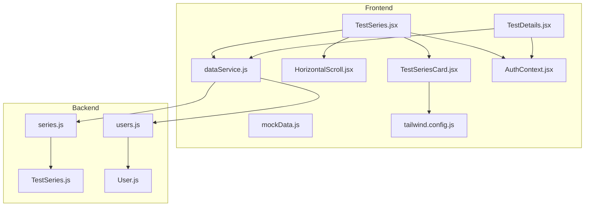
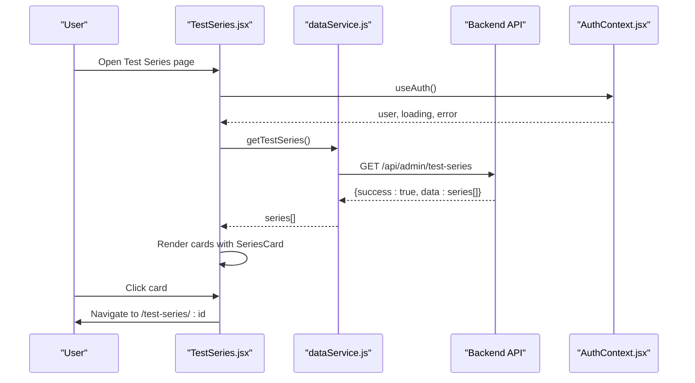
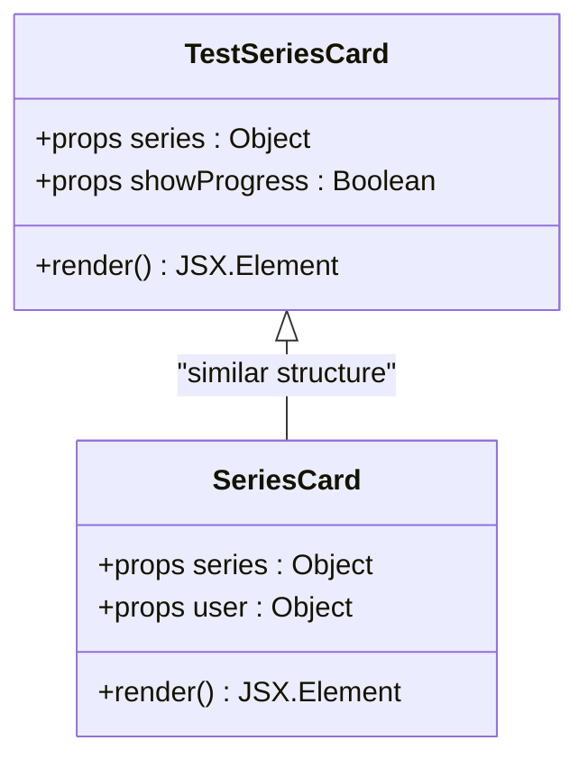
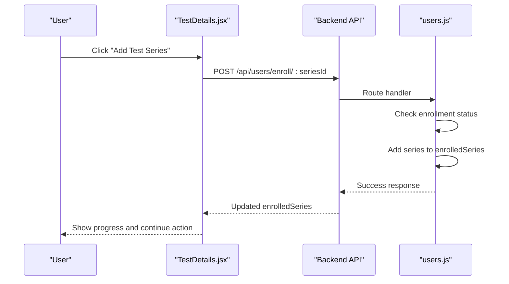
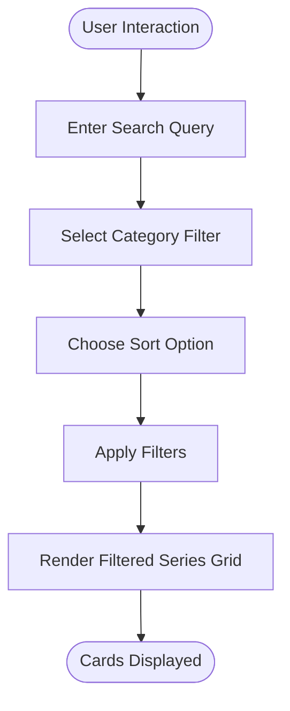
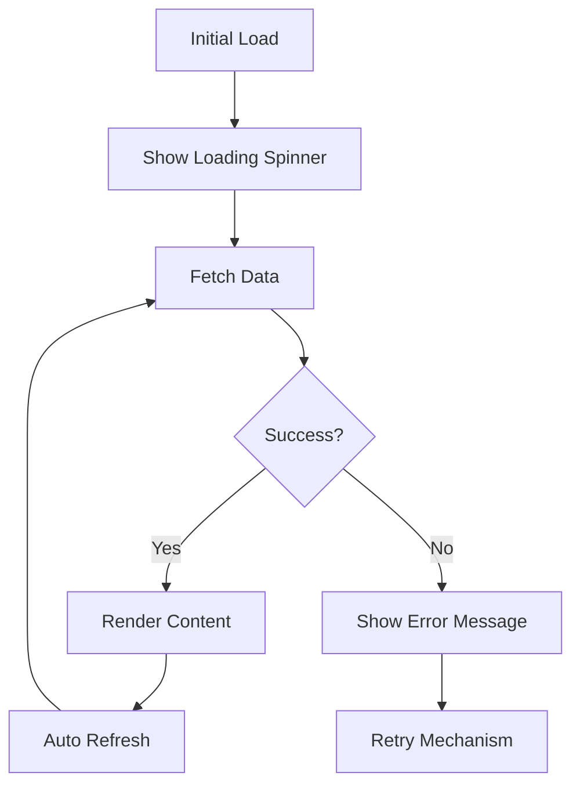
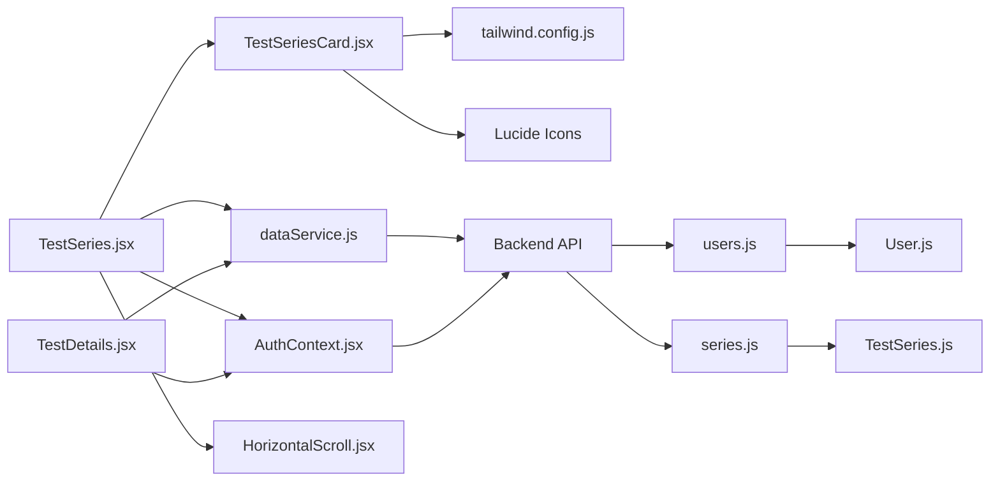

# Test-Related Components

<cite>
**Referenced Files in This Document**
- [TestSeriesCard.jsx](file://Frontend/src/components/test/TestSeriesCard.jsx)
- [TestSeries.jsx](file://Frontend/src/pages/TestSeries.jsx)
- [TestDetails.jsx](file://Frontend/src/pages/TestDetails.jsx)
- [HorizontalScroll.jsx](file://Frontend/src/components/common/HorizontalScroll.jsx)
- [dataService.js](file://Frontend/src/services/dataService.js)
- [AuthContext.jsx](file://Frontend/src/context/AuthContext.jsx)
- [mockData.js](file://Frontend/src/data/mockData.js)
- [tailwind.config.js](file://Frontend/tailwind.config.js)
- [TestSeries.js](file://Backend/src/models/TestSeries.js)
- [User.js](file://Backend/src/models/User.js)
- [users.js](file://Backend/src/routes/users.js)
- [series.js](file://Backend/src/routes/series.js)
</cite>

## Table of Contents
1. [Introduction](#introduction)
2. [Project Structure](#project-structure)
3. [Core Components](#core-components)
4. [Architecture Overview](#architecture-overview)
5. [Detailed Component Analysis](#detailed-component-analysis)
6. [Dependency Analysis](#dependency-analysis)
7. [Performance Considerations](#performance-considerations)
8. [Troubleshooting Guide](#troubleshooting-guide)
9. [Conclusion](#conclusion)

## Introduction
This document provides comprehensive documentation for Trstprep V2's test-related UI components, with primary focus on the TestSeriesCard component. The documentation covers component props, data structures, interactive elements, styling patterns, and integration with the test series management system. It explains how cards display test series information, handle enrollment states, show progress indicators, and support category filtering. The guide includes examples of different card states, loading patterns, error handling, and responsive design adaptations using TailwindCSS.

## Project Structure
The test-related components are organized across frontend pages, shared components, services, and backend models/routing. The key areas include:
- TestSeriesCard component for individual series display
- TestSeries page for browsing and filtering series
- TestDetails page for series-specific views and enrollment
- HorizontalScroll component for horizontal navigation
- dataService for API integration and caching
- AuthContext for user authentication and enrollment state
- Backend models and routes for test series and user enrollment

**Diagram sources**
- [TestSeries.jsx](file://Frontend/src/pages/TestSeries.jsx#L1-L427)
- [TestSeriesCard.jsx](file://Frontend/src/components/test/TestSeriesCard.jsx#L1-L109)
- [TestDetails.jsx](file://Frontend/src/pages/TestDetails.jsx#L1-L330)
- [HorizontalScroll.jsx](file://Frontend/src/components/common/HorizontalScroll.jsx#L1-L89)
- [dataService.js](file://Frontend/src/services/dataService.js#L1-L172)
- [AuthContext.jsx](file://Frontend/src/context/AuthContext.jsx#L1-L203)
- [mockData.js](file://Frontend/src/data/mockData.js#L1-L273)
- [tailwind.config.js](file://Frontend/tailwind.config.js#L1-L33)
- [TestSeries.js](file://Backend/src/models/TestSeries.js#L1-L71)
- [User.js](file://Backend/src/models/User.js#L1-L81)
- [users.js](file://Backend/src/routes/users.js#L54-L106)
- [series.js](file://Backend/src/routes/series.js#L55-L110)

**Section sources**
- [TestSeries.jsx](file://Frontend/src/pages/TestSeries.jsx#L1-L427)
- [TestSeriesCard.jsx](file://Frontend/src/components/test/TestSeriesCard.jsx#L1-L109)
- [dataService.js](file://Frontend/src/services/dataService.js#L1-L172)
- [AuthContext.jsx](file://Frontend/src/context/AuthContext.jsx#L1-L203)

## Core Components
This section focuses on the TestSeriesCard component and its integration with surrounding components.

### TestSeriesCard Component
The TestSeriesCard component renders an individual test series with essential metadata, visual indicators, and interactive elements. It supports an optional progress display mode and integrates with routing for navigation to series details.

Key features:
- Displays category, title, user count, rating, test types, total tests, and free tests
- Supports a showProgress prop to render a progress bar and continue action
- Uses TailwindCSS for responsive layout and hover effects
- Renders visual badges for PRO/Live/Standard test types
- Provides a call-to-action button with directional indicator

Props:
- series: Object containing series metadata (see Data Structures section)
- showProgress: Boolean flag to enable progress display and continue action

Rendering behavior:
- Header section shows category tag and title
- Stats row shows user count and rating
- Test types display with truncation and "+N more" indicator
- Tests count shows total and free counts
- Optional progress bar with percentage and gradient fill
- CTA button switches between "View Test Series" and "Continue Learning"

**Section sources**
- [TestSeriesCard.jsx](file://Frontend/src/components/test/TestSeriesCard.jsx#L4-L109)

### TestSeries Page Integration
The TestSeries page manages state for search, category filtering, sorting, and auto-refresh. It renders multiple series cards and horizontal scrolling sections for recent and enrolled series.

Key features:
- Search input filters series by title or category
- Category filter buttons toggle selection
- Sorting options for popularity, rating, and test count
- Auto-refresh mechanism with manual refresh capability
- Horizontal scroll containers for recent and enrolled series
- Conditional rendering based on user authentication and enrollment

**Section sources**
- [TestSeries.jsx](file://Frontend/src/pages/TestSeries.jsx#L1-L427)

### TestDetails Page Integration
The TestDetails page provides series-specific details, enrollment controls, and test listings. It demonstrates how progress and enrollment states are presented in a detailed context.

Key features:
- Series header with stats, description, and test types
- Enrollment state display with progress bar
- Category and sub-category filtering for tests
- Access control based on free/pro status

**Section sources**
- [TestDetails.jsx](file://Frontend/src/pages/TestDetails.jsx#L1-L330)

## Architecture Overview
The test-related UI components follow a layered architecture:
- Presentation Layer: Pages and Cards
- Service Layer: dataService for API integration and caching
- State Management: AuthContext for user authentication and enrollment state
- Backend Integration: Routes for series and user enrollment
- Data Models: MongoDB schemas for TestSeries and User

**Diagram sources**
- [TestSeries.jsx](file://Frontend/src/pages/TestSeries.jsx#L24-L49)
- [dataService.js](file://Frontend/src/services/dataService.js#L45-L50)
- [AuthContext.jsx](file://Frontend/src/context/AuthContext.jsx#L194-L200)

## Detailed Component Analysis

### TestSeriesCard Component Analysis
The TestSeriesCard component encapsulates the presentation logic for a single test series. It uses destructured props to access series data and applies TailwindCSS classes for responsive design and visual effects.

**Diagram sources**
- [TestSeriesCard.jsx](file://Frontend/src/components/test/TestSeriesCard.jsx#L4-L109)
- [TestSeries.jsx](file://Frontend/src/pages/TestSeries.jsx#L337-L424)

Component structure:
- Header: Category tag and title with hover effect
- Stats: Users count and rating with icons
- Test Types: Truncated list with PRO/Live/Standard badges
- Counts: Total tests and free tests
- Progress Bar: Optional with gradient fill and percentage
- CTA Button: Gradient background with hover expansion

Interactive elements:
- Link navigation to series details
- Hover effects for cards and buttons
- Conditional rendering based on showProgress prop

**Section sources**
- [TestSeriesCard.jsx](file://Frontend/src/components/test/TestSeriesCard.jsx#L20-L109)

### Data Structures and Props
The TestSeriesCard expects a structured series object with the following properties:
- id: Unique identifier for the series
- title: Display name of the series
- category: Category for filtering (e.g., SSC, Railway, Banking, UPSC)
- totalTests: Total number of tests in the series
- freeTests: Number of free tests available
- users: User engagement metric
- rating: Average rating value
- testTypes: Array of test type labels (PRO, Live, etc.)

Additional optional properties:
- slug: URL-friendly identifier for routing
- icon: Emoji or icon representation
- tags: Additional categorization tags
- isPro: Boolean indicating premium status

Integration with backend models:
- Backend TestSeries model defines schema fields and validation
- Backend User model tracks enrolledSeries and attemptedTests

**Section sources**
- [TestSeriesCard.jsx](file://Frontend/src/components/test/TestSeriesCard.jsx#L5-L14)
- [TestSeries.js](file://Backend/src/models/TestSeries.js#L3-L63)
- [User.js](file://Backend/src/models/User.js#L44-L52)

### Enrollment and Progress Tracking
The system supports enrollment and progress tracking through:
- User enrollment via backend route POST /api/users/enroll/:seriesId
- Progress calculation using attemptedTests map in user model
- Conditional rendering of progress bars and continue actions

**Diagram sources**
- [TestDetails.jsx](file://Frontend/src/pages/TestDetails.jsx#L175-L191)
- [users.js](file://Backend/src/routes/users.js#L54-L95)

### Category Filtering and Search
The TestSeries page implements comprehensive filtering and search:
- Search input filters by title and category
- Category filter buttons toggle selection
- Sorting options for popularity, rating, and test count
- Horizontal scroll containers for recent and enrolled series

**Diagram sources**
- [TestSeries.jsx](file://Frontend/src/pages/TestSeries.jsx#L78-L104)

**Section sources**
- [TestSeries.jsx](file://Frontend/src/pages/TestSeries.jsx#L11-L104)

### Styling Patterns and Responsive Design
The components utilize TailwindCSS for consistent styling and responsive behavior:
- Brand color palette with gradient backgrounds
- Hover effects with transitions and glow shadows
- Responsive grid layouts with min-width constraints
- Typography scales for headings and metadata
- Icon integration using Lucide React

Brand styling:
- Gradient from brand-start to brand-end
- Soft shadows and rounded corners
- Hover expansion for CTA buttons
- Category-specific color badges

Responsive adaptations:
- Grid layouts adjust columns based on screen size
- Minimum card widths for small screens
- Horizontal scrolling with navigation arrows
- Flexible typography scaling

**Section sources**
- [tailwind.config.js](file://Frontend/tailwind.config.js#L12-L28)
- [TestSeriesCard.jsx](file://Frontend/src/components/test/TestSeriesCard.jsx#L20-L109)
- [TestSeries.jsx](file://Frontend/src/pages/TestSeries.jsx#L312-L331)

### Loading Patterns and Error Handling
The application implements several loading and error handling patterns:
- Loading spinners during initial data fetch
- Auto-refresh with silent updates
- Manual refresh with visual indicator
- Empty state handling with clear filters option
- Error boundaries in service layer with fallbacks

**Diagram sources**
- [TestSeries.jsx](file://Frontend/src/pages/TestSeries.jsx#L106-L115)
- [dataService.js](file://Frontend/src/services/dataService.js#L16-L27)

**Section sources**
- [TestSeries.jsx](file://Frontend/src/pages/TestSeries.jsx#L106-L115)
- [dataService.js](file://Frontend/src/services/dataService.js#L16-L27)

## Dependency Analysis
The test-related components have the following dependencies:

**Diagram sources**
- [TestSeriesCard.jsx](file://Frontend/src/components/test/TestSeriesCard.jsx#L1-L2)
- [TestSeries.jsx](file://Frontend/src/pages/TestSeries.jsx#L1-L7)
- [TestDetails.jsx](file://Frontend/src/pages/TestDetails.jsx#L1-L8)
- [dataService.js](file://Frontend/src/services/dataService.js#L4-L13)
- [AuthContext.jsx](file://Frontend/src/context/AuthContext.jsx#L1-L2)
- [HorizontalScroll.jsx](file://Frontend/src/components/common/HorizontalScroll.jsx#L1-L2)
- [users.js](file://Backend/src/routes/users.js#L54-L95)
- [series.js](file://Backend/src/routes/series.js#L55-L93)
- [User.js](file://Backend/src/models/User.js#L44-L52)
- [TestSeries.js](file://Backend/src/models/TestSeries.js#L3-L63)

**Section sources**
- [TestSeries.jsx](file://Frontend/src/pages/TestSeries.jsx#L1-L7)
- [TestDetails.jsx](file://Frontend/src/pages/TestDetails.jsx#L1-L8)
- [dataService.js](file://Frontend/src/services/dataService.js#L4-L13)
- [AuthContext.jsx](file://Frontend/src/context/AuthContext.jsx#L1-L2)

## Performance Considerations
- Caching: dataService implements a 5-second cache for API responses to reduce network requests
- Memoization: useMemo is used for derived data calculations (enrolled/recent series)
- Auto-refresh: Configurable interval (1 second) for real-time updates
- Lazy loading: Horizontal scroll containers prevent unnecessary re-renders
- Optimized rendering: Conditional rendering based on user state and progress

Recommendations:
- Implement pagination for large series lists
- Debounce search input for better UX
- Use virtualized lists for infinite scrolling
- Optimize image loading with lazy loading attributes

## Troubleshooting Guide
Common issues and resolutions:
- Authentication errors: Verify token presence and validity in localStorage
- Enrollment failures: Check backend route permissions and user enrollment status
- Data fetching errors: Inspect API endpoint availability and CORS configuration
- Progress not updating: Ensure attemptedTests map is properly maintained in user state
- Styling inconsistencies: Verify TailwindCSS configuration and custom color definitions

Debugging steps:
1. Check browser console for JavaScript errors
2. Verify network tab shows successful API responses
3. Confirm localStorage contains valid session and token
4. Inspect component props for missing or undefined values
5. Validate backend route responses and user permissions

**Section sources**
- [AuthContext.jsx](file://Frontend/src/context/AuthContext.jsx#L43-L98)
- [users.js](file://Backend/src/routes/users.js#L54-L95)
- [dataService.js](file://Frontend/src/services/dataService.js#L16-L27)

## Conclusion
The TestSeriesCard component and associated test-related UI components provide a comprehensive foundation for displaying, filtering, and interacting with test series. The implementation leverages modern React patterns, TailwindCSS for styling, and a robust backend integration for enrollment and progress tracking. The components are designed with responsiveness, accessibility, and performance in mind, offering a scalable architecture for future enhancements.

*Last Updated: March 10, 2026 | Update date is (20:16)*
