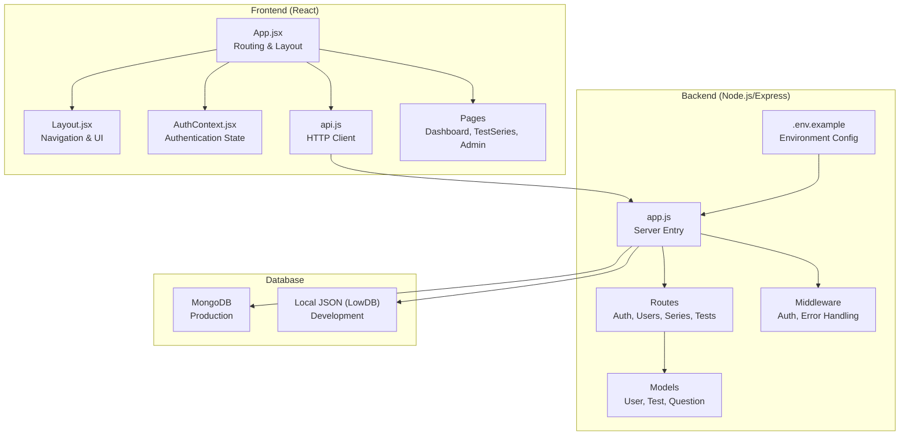
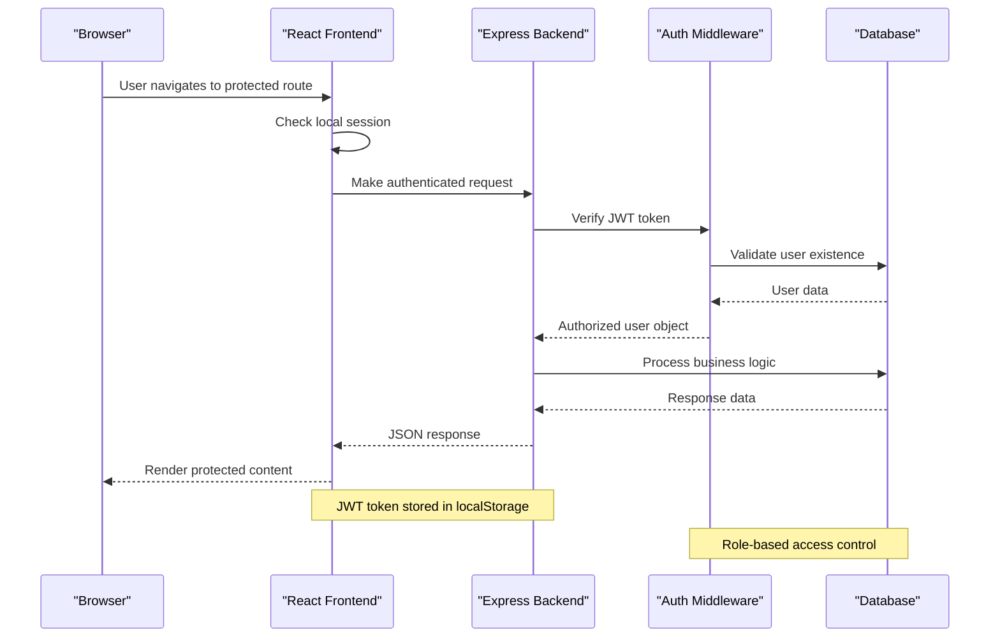
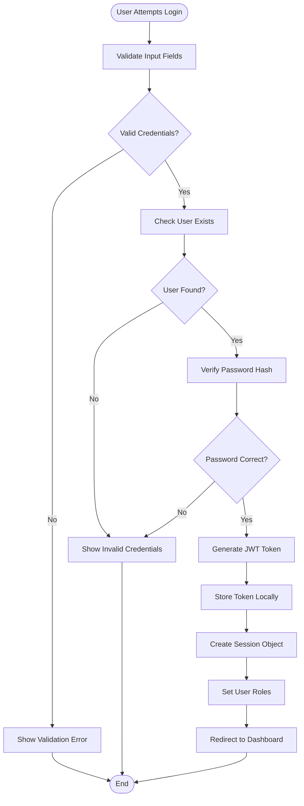
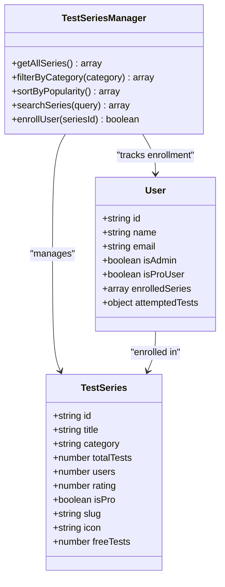
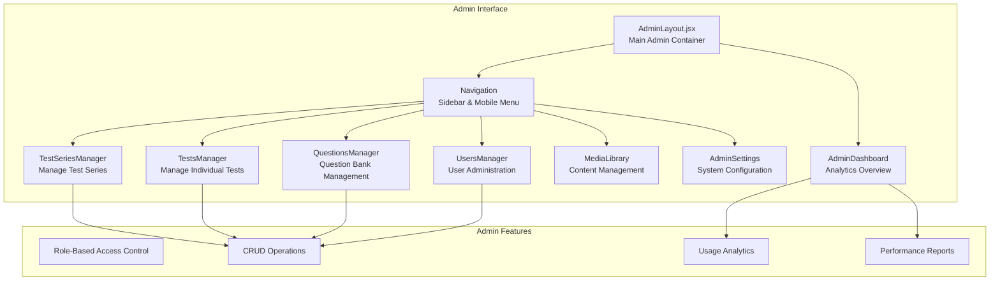
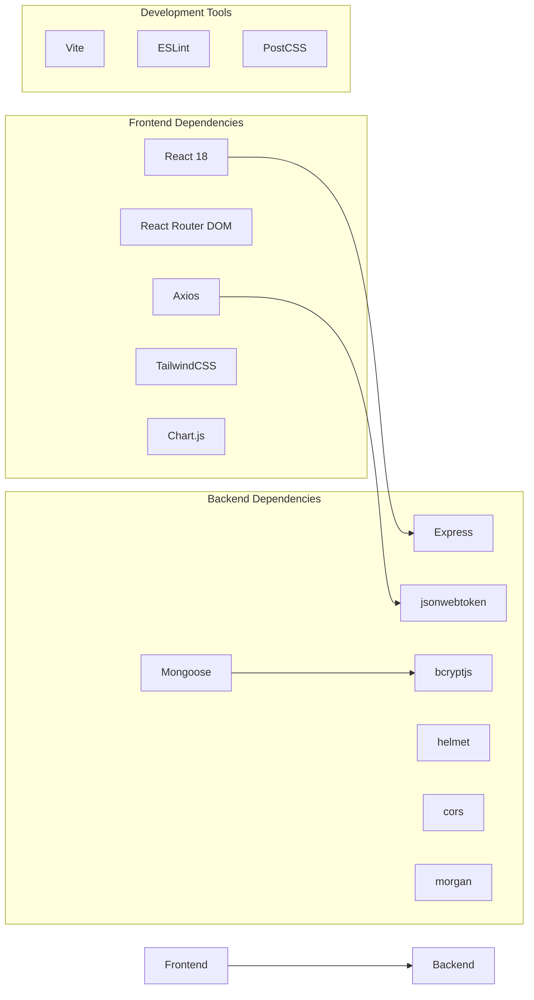

# Project Overview

<cite>
**Referenced Files in This Document**
- [Backend package.json](file://Backend/package.json)
- [Frontend package.json](file://Frontend/package.json)
- [Backend app.js](file://Backend/src/app.js)
- [Backend .env.example](file://Backend/.env.example)
- [Backend auth middleware](file://Backend/src/middleware/auth.js)
- [Backend User model](file://Backend/src/models/User.js)
- [Backend auth routes](file://Backend/src/routes/auth.js)
- [Frontend App.jsx](file://Frontend/src/App.jsx)
- [Frontend AuthContext.jsx](file://Frontend/src/context/AuthContext.jsx)
- [Frontend api.js](file://Frontend/src/services/api.js)
- [Frontend Layout.jsx](file://Frontend/src/components/layout/Layout.jsx)
- [Frontend AdminLayout.jsx](file://Frontend/src/components/admin/AdminLayout.jsx)
- [Frontend Dashboard.jsx](file://Frontend/src/pages/Dashboard.jsx)
- [Frontend TestSeries.jsx](file://Frontend/src/pages/TestSeries.jsx)
- [Documentation README.md](file://Documentation/README.md)
</cite>

## Table of Contents
1. [Introduction](#introduction)
2. [Project Structure](#project-structure)
3. [Core Components](#core-components)
4. [Architecture Overview](#architecture-overview)
5. [Detailed Component Analysis](#detailed-component-analysis)
6. [Dependency Analysis](#dependency-analysis)
7. [Performance Considerations](#performance-considerations)
8. [Troubleshooting Guide](#troubleshooting-guide)
9. [Conclusion](#conclusion)

## Introduction
Trstprep V2 is an educational test preparation platform designed to help competitive exam aspirants prepare for SSC, Railway, Banking, Defence, and State-level examinations. The platform offers a comprehensive suite of features including test series management, interactive test-taking experiences, result analysis, and content management. It serves as a full-stack web application with a modern React frontend and a Node.js/Express backend, providing a scalable foundation for delivering exam preparation resources to thousands of users.

The platform’s core value proposition lies in its integrated approach to exam preparation:
- Curated test series aligned with specific exam patterns
- Real-time and timed test modes for realistic practice
- Personalized analytics and performance insights
- Pro membership tier for advanced content and features
- Admin-driven content curation and user management

Target audience:
- SSC aspirants preparing for CGL, CHSL, GD, Stenographer, and other SSC exams
- Railway exam candidates for NTPC, Group D, ALP, Technician, and other RRB posts
- Banking exam hopefuls for Clerk, PO, RRB, and other banking positions
- Defence exam candidates for various defence forces and armed forces exams
- State government exam aspirants for various state-level competitive exams

## Project Structure
The project follows a clear separation of concerns with distinct frontend and backend directories, each containing modular components, services, and configuration files. The frontend leverages React with Vite for fast development and optimized builds, while the backend uses Express.js with MongoDB for data persistence.

**Diagram sources**
- [Frontend App.jsx](file://Frontend/src/App.jsx#L42-L140)
- [Frontend Layout.jsx](file://Frontend/src/components/layout/Layout.jsx#L8-L83)
- [Frontend AuthContext.jsx](file://Frontend/src/context/AuthContext.jsx#L13-L191)
- [Frontend api.js](file://Frontend/src/services/api.js#L4-L91)
- [Backend app.js](file://Backend/src/app.js#L24-L94)
- [Backend auth middleware](file://Backend/src/middleware/auth.js#L5-L92)
- [Backend User model](file://Backend/src/models/User.js#L4-L81)
- [Backend .env.example](file://Backend/.env.example#L1-L17)

**Section sources**
- [Documentation README.md](file://Documentation/README.md#L5-L28)
- [Frontend package.json](file://Frontend/package.json#L1-L35)
- [Backend package.json](file://Backend/package.json#L1-L32)

## Core Components
The platform consists of several core components that work together to deliver a seamless exam preparation experience:

### Frontend Components
- **App Routing**: Central routing configuration with protected routes, nested layouts, and admin-specific navigation
- **Authentication Context**: Manages user sessions, login/logout, and role-based access control
- **Layout System**: Responsive navigation with top navbar, sidebar, and bottom navigation for mobile devices
- **API Services**: Axios-based HTTP client with interceptors for authentication and error handling
- **Pages**: Comprehensive page components for dashboard, test series browsing, test interface, and admin panels

### Backend Components
- **Express Server**: Modular server setup with security middleware, CORS configuration, and health checks
- **Authentication Middleware**: JWT-based authentication with role-based access control (admin/pro users)
- **Database Models**: Mongoose schemas for users, tests, questions, and test series with proper validation
- **API Routes**: RESTful endpoints for authentication, user management, test series, and administrative functions

**Section sources**
- [Frontend App.jsx](file://Frontend/src/App.jsx#L42-L140)
- [Frontend AuthContext.jsx](file://Frontend/src/context/AuthContext.jsx#L13-L191)
- [Frontend api.js](file://Frontend/src/services/api.js#L4-L91)
- [Backend app.js](file://Backend/src/app.js#L24-L94)
- [Backend auth middleware](file://Backend/src/middleware/auth.js#L5-L92)
- [Backend User model](file://Backend/src/models/User.js#L4-L81)

## Architecture Overview
Trstprep V2 follows a full-stack architecture with clear separation between frontend and backend concerns. The system employs JWT authentication with role-based access control, supporting both free users and premium Pro members.

**Diagram sources**
- [Frontend AuthContext.jsx](file://Frontend/src/context/AuthContext.jsx#L43-L98)
- [Frontend api.js](file://Frontend/src/services/api.js#L13-L44)
- [Backend auth middleware](file://Backend/src/middleware/auth.js#L5-L44)
- [Backend auth routes](file://Backend/src/routes/auth.js#L129-L161)

The architecture supports:
- **JWT Authentication**: Secure token-based authentication with configurable expiration
- **Role-Based Access Control**: Distinctions between regular users, Pro members, and administrators
- **Protected Routes**: Automatic enforcement of authentication requirements across frontend routes
- **Database Abstraction**: Support for both local JSON database (development) and MongoDB (production)

**Section sources**
- [Backend app.js](file://Backend/src/app.js#L27-L66)
- [Backend auth middleware](file://Backend/src/middleware/auth.js#L68-L92)
- [Frontend App.jsx](file://Frontend/src/App.jsx#L88-L116)

## Detailed Component Analysis

### Authentication and Authorization System
The platform implements a robust authentication system with multiple layers of security and access control:

**Diagram sources**
- [Backend auth routes](file://Backend/src/routes/auth.js#L19-L71)
- [Backend auth routes](file://Backend/src/routes/auth.js#L76-L124)
- [Frontend AuthContext.jsx](file://Frontend/src/context/AuthContext.jsx#L43-L98)

Key authentication features:
- **JWT Token Generation**: Secure token creation with configurable expiration
- **Password Hashing**: bcrypt-based password encryption with salt rounds
- **Role Detection**: Automatic role assignment based on user data
- **Session Management**: Local storage-based session persistence with expiration
- **Protected Routes**: Automatic authentication enforcement across frontend routes

**Section sources**
- [Backend auth routes](file://Backend/src/routes/auth.js#L19-L124)
- [Backend auth middleware](file://Backend/src/middleware/auth.js#L5-L44)
- [Frontend AuthContext.jsx](file://Frontend/src/context/AuthContext.jsx#L13-L98)

### Test Series Management System
The platform provides comprehensive test series management with filtering, sorting, and enrollment capabilities:

**Diagram sources**
- [Frontend TestSeries.jsx](file://Frontend/src/pages/TestSeries.jsx#L338-L424)
- [Frontend Dashboard.jsx](file://Frontend/src/pages/Dashboard.jsx#L24-L44)
- [Backend User model](file://Backend/src/models/User.js#L44-L52)

The test series management includes:
- **Category Filtering**: Support for SSC, Railway, Banking, UPSC categories
- **Sorting Options**: Popularity, rating, and test count sorting
- **Search Functionality**: Real-time search across series titles and categories
- **Enrollment Tracking**: User-specific enrollment and progress tracking
- **Progress Visualization**: Progress bars and completion percentages

**Section sources**
- [Frontend TestSeries.jsx](file://Frontend/src/pages/TestSeries.jsx#L23-L104)
- [Frontend Dashboard.jsx](file://Frontend/src/pages/Dashboard.jsx#L24-L44)

### Admin Panel Architecture
The admin panel provides comprehensive content management capabilities with role-based access control:

**Diagram sources**
- [Frontend AdminLayout.jsx](file://Frontend/src/components/admin/AdminLayout.jsx#L31-L47)
- [Frontend AdminLayout.jsx](file://Frontend/src/components/admin/AdminLayout.jsx#L127-L305)

The admin panel supports:
- **Multi-Level Navigation**: Collapsible sidebar with expandable sections
- **Content Management**: Full CRUD operations for test series, questions, and users
- **User Administration**: Role assignment, subscription management, and account moderation
- **Analytics Dashboard**: Performance metrics and usage statistics
- **Media Library**: File upload and content asset management

**Section sources**
- [Frontend AdminLayout.jsx](file://Frontend/src/components/admin/AdminLayout.jsx#L8-L305)

## Dependency Analysis
The project maintains clean dependency boundaries between frontend and backend components, with clear interfaces for communication.

**Diagram sources**
- [Frontend package.json](file://Frontend/package.json#L12-L32)
- [Backend package.json](file://Backend/package.json#L12-L27)

**Section sources**
- [Frontend package.json](file://Frontend/package.json#L1-L35)
- [Backend package.json](file://Backend/package.json#L1-L32)

## Performance Considerations
The platform is designed with performance optimization in mind through several key strategies:

- **Frontend Optimization**: React's component-based architecture with efficient re-rendering and memoization
- **API Efficiency**: Optimized database queries with proper indexing and caching strategies
- **Resource Loading**: Lazy loading of components and images to improve initial load times
- **State Management**: Centralized authentication state to avoid unnecessary API calls
- **Responsive Design**: Mobile-first approach with adaptive layouts for optimal performance across devices

## Troubleshooting Guide
Common issues and their solutions:

### Authentication Issues
- **Token Not Found**: Verify JWT_SECRET environment variable is properly configured
- **Session Expired**: Check token expiration settings and implement automatic refresh
- **CORS Errors**: Ensure FRONTEND_URL matches the actual frontend origin

### Database Connectivity
- **Connection Failures**: Verify MONGODB_URI configuration for production vs development
- **Local Database**: Confirm lowdb initialization and file permissions
- **Model Validation**: Check Mongoose schema validation errors

### Frontend Issues
- **Route Protection**: Verify ProtectedRoute component wrapping and auth context usage
- **API Communication**: Check VITE_API_URL environment variable and CORS configuration
- **Build Errors**: Ensure Node.js version compatibility and dependency installation

**Section sources**
- [Backend .env.example](file://Backend/.env.example#L1-L17)
- [Frontend api.js](file://Frontend/src/services/api.js#L13-L44)
- [Documentation README.md](file://Documentation/README.md#L100-L125)

## Conclusion
Trstprep V2 represents a comprehensive educational platform designed to serve the growing needs of competitive exam aspirants across multiple government recruitment sectors. The platform's architecture balances scalability with maintainability, providing a solid foundation for future enhancements while delivering immediate value to users.

Key strengths of the platform include:
- **Comprehensive Exam Coverage**: Support for SSC, Railway, Banking, Defence, and State exams
- **Modern Technology Stack**: React frontend with Express backend ensures maintainable and scalable code
- **Robust Security**: JWT-based authentication with role-based access control
- **Admin Flexibility**: Comprehensive content management capabilities for platform operators
- **Performance Focus**: Optimized architecture supporting thousands of concurrent users

The platform's modular design allows for easy extension and customization, making it suitable for both small-scale implementations and enterprise-level deployments. With its focus on user experience and educational effectiveness, Trstprep V2 provides a strong foundation for building a successful online test preparation service.

*Last Updated: March 10, 2026 | Update date is (20:16)*
