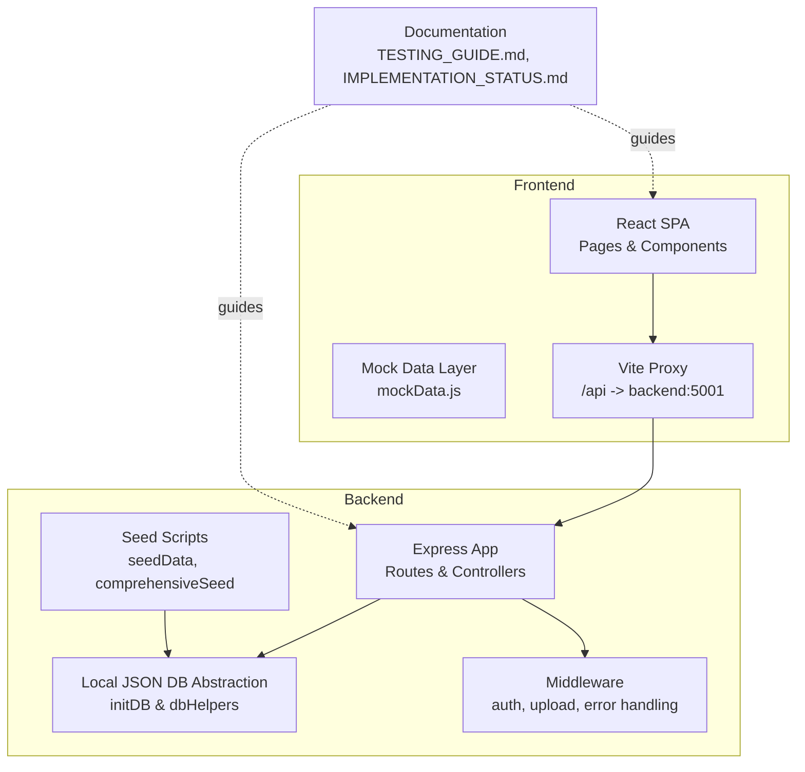
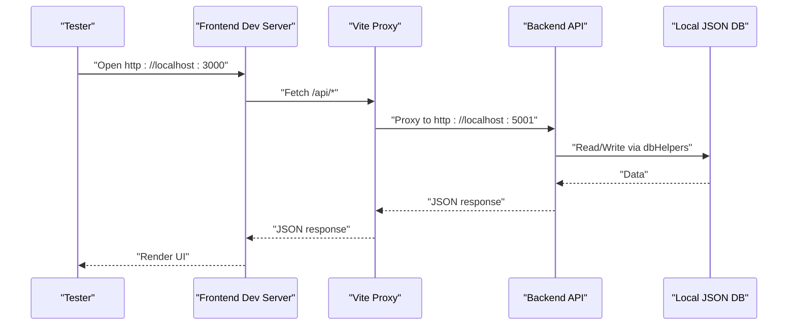
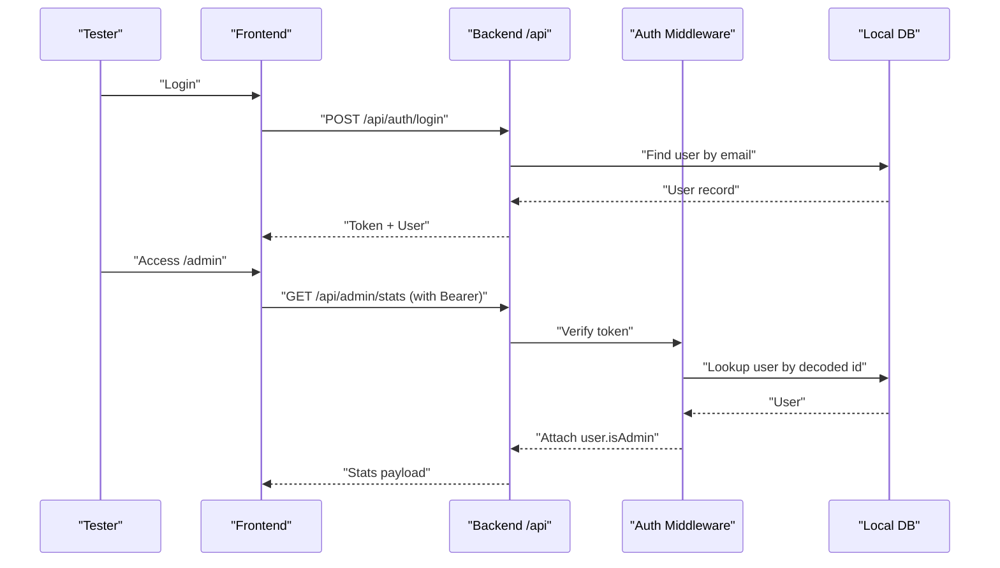
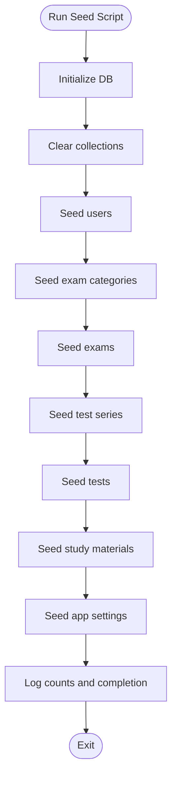
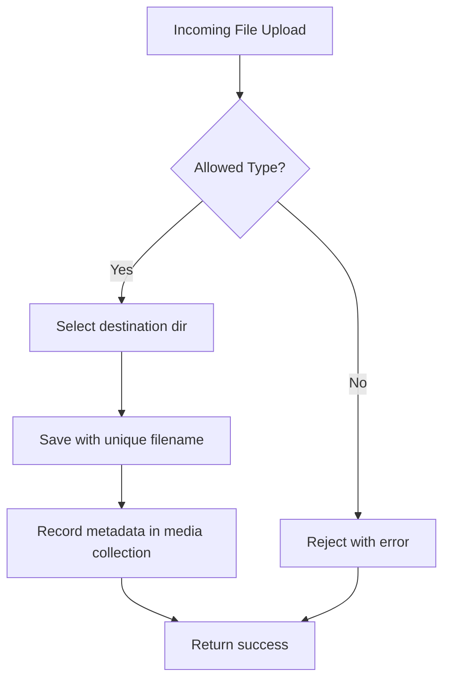
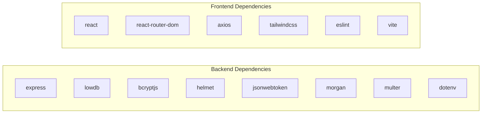

# Testing & Quality Assurance

<cite>
**Referenced Files in This Document**
- [TESTING_GUIDE.md](file://Documentation/TESTING_GUIDE.md)
- [IMPLEMENTATION_STATUS.md](file://Documentation/IMPLEMENTATION_STATUS.md)
- [package.json](file://Backend/package.json)
- [package.json](file://Frontend/package.json)
- [comprehensiveSeed.js](file://Backend/src/seed/comprehensiveSeed.js)
- [seedData.js](file://Backend/src/seed/seedData.js)
- [localDB.js](file://Backend/src/db/localDB.js)
- [auth.js](file://Backend/src/middleware/auth.js)
- [errorHandler.js](file://Backend/src/middleware/errorHandler.js)
- [upload.js](file://Backend/src/middleware/upload.js)
- [User.js](file://Backend/src/models/User.js)
- [Test.js](file://Backend/src/models/Test.js)
- [mockData.js](file://Frontend/src/data/mockData.js)
- [vite.config.js](file://Frontend/vite.config.js)
- [tailwind.config.js](file://Frontend/tailwind.config.js)
- [postcss.config.js](file://Frontend/postcss.config.js)
</cite>

## Table of Contents
1. [Introduction](#introduction)
2. [Project Structure](#project-structure)
3. [Core Components](#core-components)
4. [Architecture Overview](#architecture-overview)
5. [Detailed Component Analysis](#detailed-component-analysis)
6. [Dependency Analysis](#dependency-analysis)
7. [Performance Considerations](#performance-considerations)
8. [Security Testing Approaches](#security-testing-approaches)
9. [User Acceptance Testing Procedures](#user-acceptance-testing-procedures)
10. [Bug Tracking and Issue Resolution](#bug-tracking-and-issue-resolution)
11. [Quality Gates for Production Deployment](#quality-gates-for-production-deployment)
12. [Conclusion](#conclusion)
13. [Appendices](#appendices)

## Introduction
This document provides comprehensive testing and quality assurance guidance for Trstprep V2. It covers testing strategy (unit, integration, and end-to-end), implementation status and missing features, quality metrics, seed data and test data management, automated testing procedures, code quality standards, linting, continuous integration practices, performance and security testing, user acceptance testing, bug tracking workflows, and quality gates for production.

## Project Structure
Trstprep V2 consists of:
- Backend: Express-based API with a local JSON database abstraction, middleware for auth and uploads, and seed scripts for test data.
- Frontend: React SPA with Vite, Tailwind CSS, and a mock data layer for initial development.
- Documentation: Implementation status and testing guides.

**Diagram sources**
- [localDB.js](file://Backend/src/db/localDB.js#L45-L77)
- [auth.js](file://Backend/src/middleware/auth.js#L5-L44)
- [upload.js](file://Backend/src/middleware/upload.js#L31-L83)
- [seedData.js](file://Backend/src/seed/seedData.js#L4-L233)
- [comprehensiveSeed.js](file://Backend/src/seed/comprehensiveSeed.js#L4-L449)
- [mockData.js](file://Frontend/src/data/mockData.js#L1-L273)
- [vite.config.js](file://Frontend/vite.config.js#L7-L15)
- [TESTING_GUIDE.md](file://Documentation/TESTING_GUIDE.md#L1-L264)
- [IMPLEMENTATION_STATUS.md](file://Documentation/IMPLEMENTATION_STATUS.md#L1-L183)

**Section sources**
- [TESTING_GUIDE.md](file://Documentation/TESTING_GUIDE.md#L1-L264)
- [IMPLEMENTATION_STATUS.md](file://Documentation/IMPLEMENTATION_STATUS.md#L1-L183)
- [localDB.js](file://Backend/src/db/localDB.js#L1-L219)
- [mockData.js](file://Frontend/src/data/mockData.js#L1-L273)
- [vite.config.js](file://Frontend/vite.config.js#L1-L21)

## Core Components
- Local JSON database abstraction with helper functions for CRUD and counts.
- Authentication middleware with token verification and role checks.
- Upload middleware supporting video, PDF, and image files with size limits.
- Seed scripts for initial and comprehensive data population.
- Frontend mock data layer for rapid UI development.
- Vite proxy configuration for seamless API integration during development.

Key implementation status highlights:
- Admin API routes and CRUD coverage are implemented.
- File upload system configured with storage and filtering.
- Seed scripts migrated mock data to the database.

**Section sources**
- [localDB.js](file://Backend/src/db/localDB.js#L79-L216)
- [auth.js](file://Backend/src/middleware/auth.js#L5-L92)
- [upload.js](file://Backend/src/middleware/upload.js#L10-L91)
- [seedData.js](file://Backend/src/seed/seedData.js#L4-L233)
- [comprehensiveSeed.js](file://Backend/src/seed/comprehensiveSeed.js#L4-L449)
- [mockData.js](file://Frontend/src/data/mockData.js#L1-L273)
- [IMPLEMENTATION_STATUS.md](file://Documentation/IMPLEMENTATION_STATUS.md#L15-L47)

## Architecture Overview
The testing and QA architecture integrates backend API testing, frontend integration testing via proxy, and database-backed seed data.

**Diagram sources**
- [vite.config.js](file://Frontend/vite.config.js#L9-L14)
- [localDB.js](file://Backend/src/db/localDB.js#L79-L216)

## Detailed Component Analysis

### Authentication and Admin Routes Testing
Focus areas:
- Token generation and verification.
- Admin-only route protection.
- Consistency between auth middleware and admin routes.

Recommended manual steps:
- Clear browser storage and re-login using documented credentials.
- Verify tokens in localStorage and admin dashboard data visibility.
- Confirm 200 responses for admin endpoints versus 401 failures prior to fixes.

**Diagram sources**
- [auth.js](file://Backend/src/middleware/auth.js#L5-L44)
- [localDB.js](file://Backend/src/db/localDB.js#L117-L130)
- [TESTING_GUIDE.md](file://Documentation/TESTING_GUIDE.md#L17-L137)

**Section sources**
- [auth.js](file://Backend/src/middleware/auth.js#L5-L92)
- [TESTING_GUIDE.md](file://Documentation/TESTING_GUIDE.md#L15-L137)

### Seed Data System and Test Data Management
Seed scripts:
- Initial seed: creates users, test series, tests, and sample questions.
- Comprehensive seed: migrates larger dataset from mockData.js and seeds app settings.

Data model mapping:
- Users, enrollments, results.
- Test series, tests, questions, categories.
- Study materials, chapters, videos, pdfs.
- Exams, media, app settings, navigation menu, banners, notifications.

**Diagram sources**
- [seedData.js](file://Backend/src/seed/seedData.js#L4-L233)
- [comprehensiveSeed.js](file://Backend/src/seed/comprehensiveSeed.js#L4-L449)
- [localDB.js](file://Backend/src/db/localDB.js#L9-L41)

**Section sources**
- [seedData.js](file://Backend/src/seed/seedData.js#L4-L233)
- [comprehensiveSeed.js](file://Backend/src/seed/comprehensiveSeed.js#L4-L449)
- [localDB.js](file://Backend/src/db/localDB.js#L9-L41)
- [IMPLEMENTATION_STATUS.md](file://Documentation/IMPLEMENTATION_STATUS.md#L66-L118)

### Upload and Media Management Testing
Focus areas:
- File type filtering (images, PDFs, videos).
- Unique filename generation and destination routing.
- Static file serving under /uploads.

Manual verification checklist:
- Upload allowed types and verify destination folder.
- Attempt disallowed type upload and confirm rejection.
- Verify uploaded file URL generation and accessibility.

**Diagram sources**
- [upload.js](file://Backend/src/middleware/upload.js#L56-L83)
- [upload.js](file://Backend/src/middleware/upload.js#L86-L89)

**Section sources**
- [upload.js](file://Backend/src/middleware/upload.js#L10-L91)
- [IMPLEMENTATION_STATUS.md](file://Documentation/IMPLEMENTATION_STATUS.md#L32-L40)

### Frontend Mock Data and Transition to Real APIs
Current state:
- Frontend uses mockData.js for rapid UI development.
- Next phase involves removing mock imports and connecting to real backend APIs.

Testing implications:
- UI components should be designed to accept either mock or API-provided data.
- End-to-end tests should validate data flow from backend to frontend.

**Section sources**
- [mockData.js](file://Frontend/src/data/mockData.js#L1-L273)
- [IMPLEMENTATION_STATUS.md](file://Documentation/IMPLEMENTATION_STATUS.md#L137-L141)

## Dependency Analysis
External libraries and their roles:
- Backend: Express, lowdb for local JSON persistence, bcrypt for hashing, helmet for security headers, jsonwebtoken for auth, morgan for logging, multer for uploads, dotenv for environment variables.
- Frontend: React, React Router, Axios for HTTP, Tailwind CSS, ESLint for linting, Vite for dev/build.

**Diagram sources**
- [package.json](file://Backend/package.json#L12-L27)
- [package.json](file://Frontend/package.json#L12-L33)

**Section sources**
- [package.json](file://Backend/package.json#L1-L32)
- [package.json](file://Frontend/package.json#L1-L35)

## Performance Considerations
- Database operations: Local JSON reads/writes are synchronous and suitable for small datasets. Monitor write frequency and consider batching operations.
- Uploads: 500 MB limit per file; validate client-side progress indicators and error handling.
- Frontend: Enable production builds and source maps for debugging; monitor bundle size and lazy-load heavy components.
- API latency: Use Vercel deployment settings (where applicable) and CDN for static assets.

[No sources needed since this section provides general guidance]

## Security Testing Approaches
- Authentication:
  - Verify token presence and validity for protected routes.
  - Test admin-only endpoints with non-admin tokens.
  - Confirm password hashing and secure token storage.
- Authorization:
  - Role-based access controls for admin features.
  - Pro Pass middleware for premium content.
- Input validation and sanitization:
  - Validate and sanitize all inputs on the server.
  - Enforce rate limiting for auth endpoints.
- File uploads:
  - Confirm allowed MIME types and size limits.
  - Verify unique filenames and safe storage paths.
- Error handling:
  - Ensure generic error messages and no stack traces in production.
  - Validate 404 handling for missing resources.

**Section sources**
- [auth.js](file://Backend/src/middleware/auth.js#L5-L92)
- [errorHandler.js](file://Backend/src/middleware/errorHandler.js#L11-L51)
- [upload.js](file://Backend/src/middleware/upload.js#L56-L83)

## User Acceptance Testing Procedures
- Admin panel verification:
  - Dashboard statistics and resource listings.
  - CRUD operations for test series, tests, study materials, users, and settings.
- Functional flows:
  - Login → Admin access → Data visibility.
  - Create new test series and verify listing and stats updates.
- Regression checks:
  - After each change, re-run the checklist from the testing guide.

**Section sources**
- [TESTING_GUIDE.md](file://Documentation/TESTING_GUIDE.md#L141-L254)

## Bug Tracking and Issue Resolution
- Logging and diagnostics:
  - Backend logs for 401/404/500 responses.
  - Frontend console for network errors and JS exceptions.
- Reproduction steps:
  - Clear browser storage, re-login, and verify token presence.
  - Use curl or browser dev tools to test endpoints directly.
- Emergency reset:
  - Reseed database, restart servers, and retry after clearing browser data.

**Section sources**
- [TESTING_GUIDE.md](file://Documentation/TESTING_GUIDE.md#L64-L238)

## Quality Gates for Production Deployment
- Code quality:
  - Linting with ESLint and React plugin rules.
  - Commit hooks and pre-push checks to prevent broken builds.
- Automated checks:
  - Run linting locally before committing.
  - Ensure all tests pass (unit, integration, and end-to-end).
- Security:
  - Review authentication and authorization middleware.
  - Validate environment variables and secrets management.
- Performance:
  - Validate build artifacts and source maps.
  - Confirm upload limits and file type restrictions.
- Documentation:
  - Update implementation status and testing guide as features mature.

**Section sources**
- [package.json](file://Frontend/package.json#L9-L10)
- [tailwind.config.js](file://Frontend/tailwind.config.js#L1-L33)
- [postcss.config.js](file://Frontend/postcss.config.js#L1-L7)

## Conclusion
Trstprep V2 has established a solid foundation for testing and QA with local JSON database abstraction, comprehensive seed scripts, robust middleware, and a clear testing guide. The next steps involve completing the admin UI, transitioning from mock data to real APIs, and implementing automated testing and CI/CD practices aligned with the documented quality gates.

[No sources needed since this section summarizes without analyzing specific files]

## Appendices

### Testing Strategy Matrix
- Unit testing:
  - Backend: Validate dbHelpers, auth middleware, upload middleware, and error handling.
  - Frontend: Component unit tests with mocked API responses.
- Integration testing:
  - End-to-end API flows: auth, admin CRUD, upload, and data retrieval.
  - Frontend-backend integration via Vite proxy.
- End-to-end testing:
  - Manual regression flows for admin panel and user journeys.
  - Automated E2E scenarios for critical paths (login, admin dashboard, file upload).

[No sources needed since this section provides general guidance]

### Code Quality Standards and Linting
- ESLint configuration and React plugin rules are present in the frontend project.
- Enforce consistent formatting and disable React refresh in production builds.
- Use Tailwind utilities consistently and avoid ad-hoc CSS.

**Section sources**
- [package.json](file://Frontend/package.json#L26-L32)
- [tailwind.config.js](file://Frontend/tailwind.config.js#L1-L33)
- [postcss.config.js](file://Frontend/postcss.config.js#L1-L7)

### Continuous Integration Practices
- Recommended pipeline stages:
  - Install dependencies for backend and frontend.
  - Run linting and unit tests.
  - Seed database and run integration tests.
  - Build frontend and backend artifacts.
  - Deploy to staging and run smoke tests.
  - Deploy to production with approval gate.

[No sources needed since this section provides general guidance]

*Last Updated: March 10, 2026 | Update date is (20:16)*
