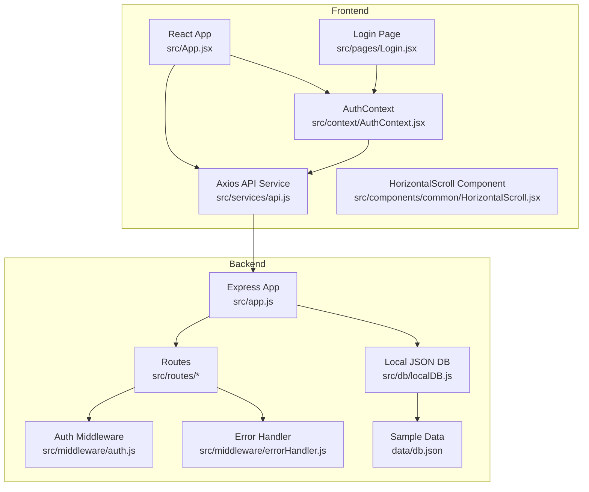
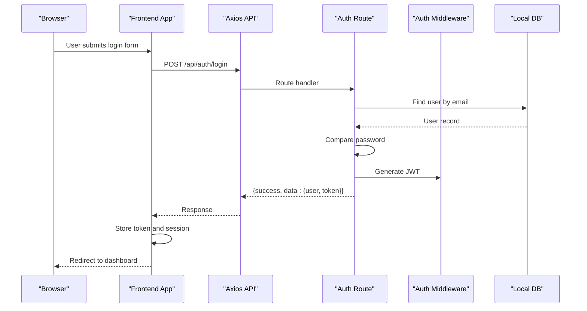
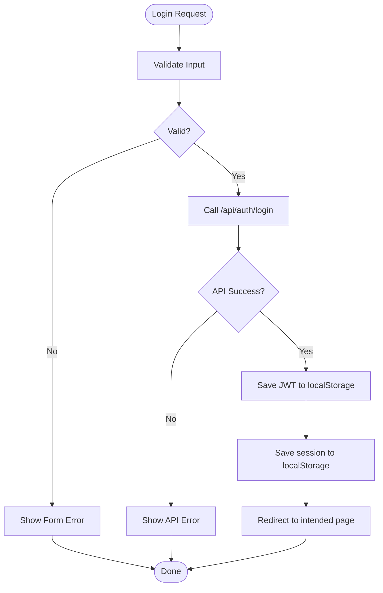
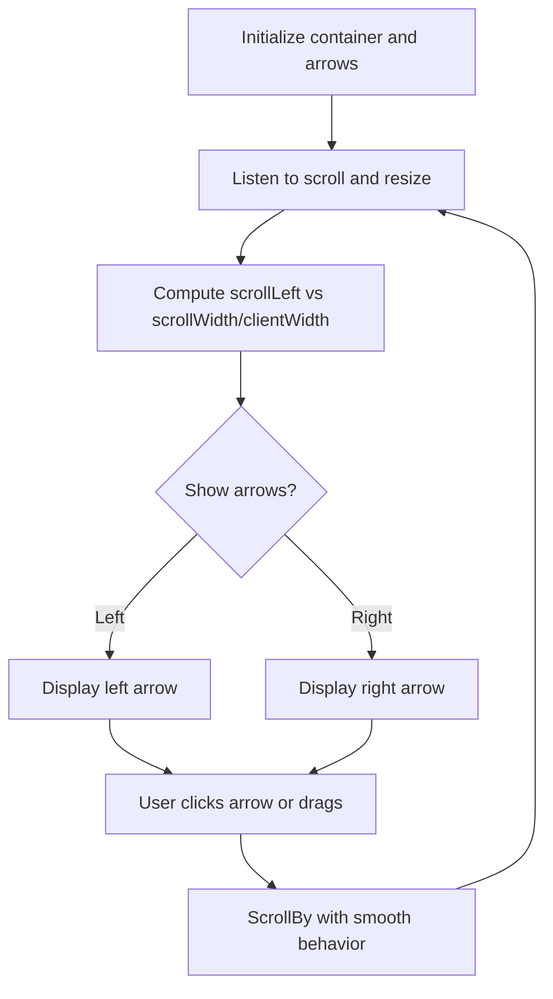
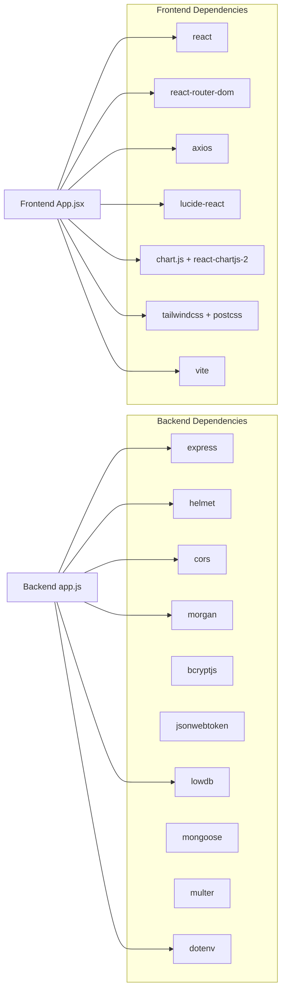

# Troubleshooting & FAQ

<cite>
**Referenced Files in This Document**
- [Backend package.json](file://Backend/package.json)
- [Backend .env.example](file://Backend/.env.example)
- [Backend src/app.js](file://Backend/src/app.js)
- [Backend src/middleware/auth.js](file://Backend/src/middleware/auth.js)
- [Backend src/middleware/errorHandler.js](file://Backend/src/middleware/errorHandler.js)
- [Backend src/routes/auth.js](file://Backend/src/routes/auth.js)
- [Backend src/db/localDB.js](file://Backend/src/db/localDB.js)
- [Backend data/db.json](file://Backend/data/db.json)
- [Frontend package.json](file://Frontend/package.json)
- [Frontend src/App.jsx](file://Frontend/src/App.jsx)
- [Frontend src/context/AuthContext.jsx](file://Frontend/src/context/AuthContext.jsx)
- [Frontend src/services/api.js](file://Frontend/src/services/api.js)
- [Frontend src/pages/Login.jsx](file://Frontend/src/pages/Login.jsx)
- [Frontend src/components/common/HorizontalScroll.jsx](file://Frontend/src/components/common/HorizontalScroll.jsx)
- [Documentation REAL_LOGIN_FIX.md](file://Documentation/REAL_LOGIN_FIX.md)
- [Documentation HORIZONTAL_SCROLL_GUIDE.md](file://Documentation/HORIZONTAL_SCROLL_GUIDE.md)
- [Documentation SLUG_GUIDE.md](file://Documentation/SLUG_GUIDE.md)
</cite>

## Table of Contents
1. [Introduction](#introduction)
2. [Project Structure](#project-structure)
3. [Core Components](#core-components)
4. [Architecture Overview](#architecture-overview)
5. [Detailed Component Analysis](#detailed-component-analysis)
6. [Dependency Analysis](#dependency-analysis)
7. [Performance Considerations](#performance-considerations)
8. [Troubleshooting Guide](#troubleshooting-guide)
9. [FAQ](#faq)
10. [Migration & Upgrade Procedures](#migration--upgrade-procedures)
11. [Conclusion](#conclusion)

## Introduction
This document provides comprehensive troubleshooting and FAQ guidance for Trstprep V2. It covers installation and runtime issues, browser compatibility, login problems, horizontal scrolling behavior, slug generation, performance diagnostics, debugging techniques for frontend and backend, and migration/upgrades. The goal is to help developers and operators quickly diagnose and resolve common issues while maintaining a smooth development and user experience.

## Project Structure
Trstprep V2 is a full-stack application with:
- Backend: Express server with a local JSON database (lowdb), JWT-based authentication, and route modules for auth, users, series, tests, study, and admin.
- Frontend: React SPA with React Router, protected routes, and Axios-based API service with interceptors.
- Documentation: Guides for login fixes, horizontal scrolling, and slug behavior.

**Diagram sources**
- [Frontend src/App.jsx](file://Frontend/src/App.jsx#L1-L143)
- [Frontend src/context/AuthContext.jsx](file://Frontend/src/context/AuthContext.jsx#L1-L203)
- [Frontend src/services/api.js](file://Frontend/src/services/api.js#L1-L92)
- [Frontend src/pages/Login.jsx](file://Frontend/src/pages/Login.jsx#L1-L212)
- [Frontend src/components/common/HorizontalScroll.jsx](file://Frontend/src/components/common/HorizontalScroll.jsx#L1-L89)
- [Backend src/app.js](file://Backend/src/app.js#L1-L94)
- [Backend src/middleware/auth.js](file://Backend/src/middleware/auth.js#L1-L92)
- [Backend src/middleware/errorHandler.js](file://Backend/src/middleware/errorHandler.js#L1-L52)
- [Backend src/db/localDB.js](file://Backend/src/db/localDB.js#L1-L221)
- [Backend data/db.json](file://Backend/data/db.json#L1-L728)

**Section sources**
- [Backend package.json](file://Backend/package.json#L1-L32)
- [Frontend package.json](file://Frontend/package.json#L1-L35)
- [Backend src/app.js](file://Backend/src/app.js#L1-L94)

## Core Components
- Authentication flow: JWT-based login, protected routes, and admin middleware.
- Local JSON database: lowdb-backed collections for users, series, tests, study materials, and app settings.
- Frontend API service: Axios instance with request/response interceptors for auth tokens and error handling.
- Horizontal scrolling: Reusable component for responsive horizontal card lists.
- Slug generation: Admin panel behavior for generating SEO-friendly slugs from titles.

**Section sources**
- [Backend src/routes/auth.js](file://Backend/src/routes/auth.js#L1-L174)
- [Backend src/middleware/auth.js](file://Backend/src/middleware/auth.js#L1-L92)
- [Backend src/db/localDB.js](file://Backend/src/db/localDB.js#L1-L221)
- [Frontend src/services/api.js](file://Frontend/src/services/api.js#L1-L92)
- [Frontend src/components/common/HorizontalScroll.jsx](file://Frontend/src/components/common/HorizontalScroll.jsx#L1-L89)
- [Documentation SLUG_GUIDE.md](file://Documentation/SLUG_GUIDE.md#L1-L119)

## Architecture Overview
The system follows a classic client-server pattern:
- Frontend React app communicates with backend via REST endpoints.
- Backend enforces authentication and authorization using JWT and middleware.
- Data is persisted in a local JSON file (lowdb) with helpers mimicking MongoDB operations.

**Diagram sources**
- [Frontend src/pages/Login.jsx](file://Frontend/src/pages/Login.jsx#L1-L212)
- [Frontend src/services/api.js](file://Frontend/src/services/api.js#L1-L92)
- [Backend src/routes/auth.js](file://Backend/src/routes/auth.js#L73-L124)
- [Backend src/middleware/auth.js](file://Backend/src/middleware/auth.js#L1-L92)
- [Backend src/db/localDB.js](file://Backend/src/db/localDB.js#L82-L132)

## Detailed Component Analysis

### Authentication and Authorization
Key behaviors:
- Login validates credentials against local DB and returns JWT plus user data.
- Protected routes rely on Authorization header with Bearer token.
- Admin middleware checks user role for admin-only endpoints.
- Frontend stores token and session; response interceptor handles 401.

**Diagram sources**
- [Frontend src/pages/Login.jsx](file://Frontend/src/pages/Login.jsx#L19-L36)
- [Frontend src/services/api.js](file://Frontend/src/services/api.js#L47-L53)
- [Backend src/routes/auth.js](file://Backend/src/routes/auth.js#L73-L124)

**Section sources**
- [Backend src/routes/auth.js](file://Backend/src/routes/auth.js#L73-L124)
- [Backend src/middleware/auth.js](file://Backend/src/middleware/auth.js#L1-L92)
- [Frontend src/context/AuthContext.jsx](file://Frontend/src/context/AuthContext.jsx#L42-L98)
- [Frontend src/services/api.js](file://Frontend/src/services/api.js#L12-L44)

### Horizontal Scrolling Component
Behavior:
- Intelligent arrow visibility based on scroll position.
- Smooth horizontal scroll with keyboard/mouse/touch support.
- Hidden scrollbars for a clean UI.

**Diagram sources**
- [Frontend src/components/common/HorizontalScroll.jsx](file://Frontend/src/components/common/HorizontalScroll.jsx#L10-L89)

**Section sources**
- [Frontend src/components/common/HorizontalScroll.jsx](file://Frontend/src/components/common/HorizontalScroll.jsx#L1-L89)
- [Documentation HORIZONTAL_SCROLL_GUIDE.md](file://Documentation/HORIZONTAL_SCROLL_GUIDE.md#L1-L69)

### Slug Generation
Behavior:
- Auto-generates a URL-friendly slug from the title.
- Allows manual editing and live URL preview in admin panel.
- Ensures SEO-friendly identifiers.

**Section sources**
- [Documentation SLUG_GUIDE.md](file://Documentation/SLUG_GUIDE.md#L1-L119)

## Dependency Analysis
- Backend depends on Express, helmet, cors, morgan, bcryptjs, jsonwebtoken, lowdb, mongoose, multer, dotenv.
- Frontend depends on React, react-router-dom, axios, lucide-react, chart.js, react-chartjs-2, Tailwind CSS/Vite.

**Diagram sources**
- [Backend package.json](file://Backend/package.json#L12-L27)
- [Frontend package.json](file://Frontend/package.json#L12-L32)
- [Backend src/app.js](file://Backend/src/app.js#L1-L94)
- [Frontend src/App.jsx](file://Frontend/src/App.jsx#L1-L143)

**Section sources**
- [Backend package.json](file://Backend/package.json#L12-L27)
- [Frontend package.json](file://Frontend/package.json#L12-L32)

## Performance Considerations
- Database operations: lowdb reads/writes occur synchronously per request; keep payload sizes reasonable and avoid excessive writes.
- Frontend rendering: avoid unnecessary re-renders; memoize derived data; lazy-load heavy components.
- Network requests: batch API calls where possible; leverage caching strategies for static resources.
- Environment: use production builds for performance; enable compression and minification.

[No sources needed since this section provides general guidance]

## Troubleshooting Guide

### Installation and Setup Issues
Common symptoms and resolutions:
- Backend fails to start due to missing environment variables:
  - Ensure environment variables are configured in a .env file matching the example.
  - Confirm PORT, MONGODB_URI, JWT_SECRET, FRONTEND_URL are set.
- Node.js version mismatch:
  - The project requires Node.js >= 18.0.0. Verify your runtime meets this requirement.
- Port conflicts:
  - Change PORT in .env if port 5001 is in use.

**Section sources**
- [Backend .env.example](file://Backend/.env.example#L1-L17)
- [Backend package.json](file://Backend/package.json#L28-L30)

### Runtime Errors and API Connectivity
Symptoms:
- 401 Unauthorized after login.
- 404 Not Found for routes.
- JWT errors or token expiration.

Resolutions:
- Verify JWT_SECRET matches between frontend and backend.
- Confirm Authorization header is present in requests.
- Check CORS configuration for frontend URL.
- Review error logs for CastError, ValidationError, or JsonWebTokenError.

**Section sources**
- [Backend src/middleware/auth.js](file://Backend/src/middleware/auth.js#L1-L92)
- [Backend src/middleware/errorHandler.js](file://Backend/src/middleware/errorHandler.js#L1-L52)
- [Backend src/app.js](file://Backend/src/app.js#L27-L32)

### Login Issues
Symptoms:
- Login appears successful but navigation does not reflect admin privileges.
- Role not detected in session.

Resolutions:
- Clear browser storage (localStorage/sessionStorage) and reload.
- Log in again with admin@trstprep.com and confirm role is saved.
- Verify backend logs show 200 for POST /api/auth/login.
- Use the documented test procedure to inspect trstprep_session and token.

**Section sources**
- [Documentation REAL_LOGIN_FIX.md](file://Documentation/REAL_LOGIN_FIX.md#L21-L172)
- [Frontend src/context/AuthContext.jsx](file://Frontend/src/context/AuthContext.jsx#L42-L98)

### Horizontal Scrolling Problems
Symptoms:
- Arrows not appearing or disappearing unexpectedly.
- Scrollbars still visible.
- Dragging does not work.

Resolutions:
- Ensure the component wraps a flex container with horizontal overflow.
- Confirm CSS for hiding scrollbars is applied.
- Check that event listeners are attached on mount and cleaned up on unmount.
- Test on both desktop (drag) and mobile (touch) devices.

**Section sources**
- [Frontend src/components/common/HorizontalScroll.jsx](file://Frontend/src/components/common/HorizontalScroll.jsx#L1-L89)
- [Documentation HORIZONTAL_SCROLL_GUIDE.md](file://Documentation/HORIZONTAL_SCROLL_GUIDE.md#L1-L69)

### Slug Generation Issues
Symptoms:
- Slug not generated from title.
- Special characters not handled.
- URL preview incorrect.

Resolutions:
- Ensure the admin panel auto-generates slug from title.
- Edit slug manually if needed; verify live preview updates.
- Keep slugs lowercase, hyphen-separated, and free of special characters.

**Section sources**
- [Documentation SLUG_GUIDE.md](file://Documentation/SLUG_GUIDE.md#L1-L119)

### Performance Problems and Memory Leaks
Symptoms:
- Slow page loads or API responses.
- High memory usage in browser.
- Frequent re-renders.

Resolutions:
- Profile frontend with React DevTools; identify expensive components.
- Minimize state updates; avoid large objects in localStorage.
- Monitor backend logs for repeated slow queries; optimize route handlers.
- Use production builds and disable dev tools in production.

**Section sources**
- [Frontend src/services/api.js](file://Frontend/src/services/api.js#L1-L92)
- [Backend src/app.js](file://Backend/src/app.js#L42-L44)

### API Connectivity Diagnostics
Steps:
- Confirm health endpoint responds: GET /api/health.
- Test login endpoint directly with curl or browser console.
- Inspect response payload for success flag and user data.
- Verify JWT token presence and validity.

**Section sources**
- [Backend src/app.js](file://Backend/src/app.js#L46-L54)
- [Backend src/routes/auth.js](file://Backend/src/routes/auth.js#L73-L124)

### Debugging Techniques

- Frontend React components:
  - Use React DevTools to inspect props, state, and hooks.
  - Add console logs around AuthContext login/signup flows.
  - Verify ProtectedRoute renders the correct layout and children.

- Backend API endpoints:
  - Enable Morgan logging in development.
  - Check middleware chain for auth and error handling.
  - Validate JWT secret and token payload.

- Database operations:
  - Confirm lowdb initialization and collection existence.
  - Verify CRUD helpers return expected results.
  - Inspect data/db.json for correctness.

**Section sources**
- [Frontend src/context/AuthContext.jsx](file://Frontend/src/context/AuthContext.jsx#L13-L191)
- [Frontend src/App.jsx](file://Frontend/src/App.jsx#L42-L140)
- [Backend src/app.js](file://Backend/src/app.js#L42-L44)
- [Backend src/middleware/auth.js](file://Backend/src/middleware/auth.js#L1-L92)
- [Backend src/db/localDB.js](file://Backend/src/db/localDB.js#L47-L79)
- [Backend data/db.json](file://Backend/data/db.json#L1-L728)

## FAQ

Q: What Node.js version is required?
A: Node.js >= 18.0.0.

Q: How do I configure environment variables?
A: Copy .env.example to .env and set PORT, MONGODB_URI, JWT_SECRET, FRONTEND_URL.

Q: Why is my login not persisting?
A: Clear localStorage and sessionStorage, then log in again. Confirm role is saved and backend logs show 200.

Q: How do I enable admin features?
A: Use admin@trstprep.com with the documented password. Verify role is present in session.

Q: Why do I see scrollbars despite the component claiming to hide them?
A: Ensure the component applies the correct CSS and inline styles. Test on different browsers.

Q: How are slugs generated?
A: Titles are transformed to lowercase, spaces to hyphens, and special characters removed. You can edit the slug manually.

Q: How do I migrate from local JSON to MongoDB?
A: Update the database connection in the backend initialization and adjust schema accordingly.

**Section sources**
- [Backend package.json](file://Backend/package.json#L28-L30)
- [Backend .env.example](file://Backend/.env.example#L1-L17)
- [Documentation REAL_LOGIN_FIX.md](file://Documentation/REAL_LOGIN_FIX.md#L21-L172)
- [Frontend src/components/common/HorizontalScroll.jsx](file://Frontend/src/components/common/HorizontalScroll.jsx#L60-L74)
- [Documentation SLUG_GUIDE.md](file://Documentation/SLUG_GUIDE.md#L21-L27)
- [Backend src/app.js](file://Backend/src/app.js#L68-L78)

## Migration & Upgrade Procedures

### From Demo Auth to Real Backend
- Replace hardcoded demo users with real API calls.
- Ensure JWT token and user role are stored and used for navigation.
- Clear browser storage and log in again to validate.

**Section sources**
- [Documentation REAL_LOGIN_FIX.md](file://Documentation/REAL_LOGIN_FIX.md#L1-L172)
- [Frontend src/context/AuthContext.jsx](file://Frontend/src/context/AuthContext.jsx#L42-L98)

### Upgrading Node.js
- Update your runtime to Node.js >= 18.0.0.
- Reinstall dependencies after version change.

**Section sources**
- [Backend package.json](file://Backend/package.json#L28-L30)

### Migrating to MongoDB
- Update connection string in environment variables.
- Modify database helpers to use MongoDB driver.
- Align schema and indexes with MongoDB requirements.

**Section sources**
- [Backend .env.example](file://Backend/.env.example#L5-L8)
- [Backend src/db/localDB.js](file://Backend/src/db/localDB.js#L1-L221)

## Conclusion
This guide consolidates practical steps to troubleshoot and maintain Trstprep V2. By validating environment configuration, understanding authentication flows, inspecting frontend and backend logs, and following the documented procedures for login, scrolling, and slug generation, most issues can be resolved efficiently. For upgrades and migrations, carefully update environment variables, database connections, and code paths while verifying behavior across browsers and devices.

*Last Updated: March 10, 2026 | Update date is (20:16)*
