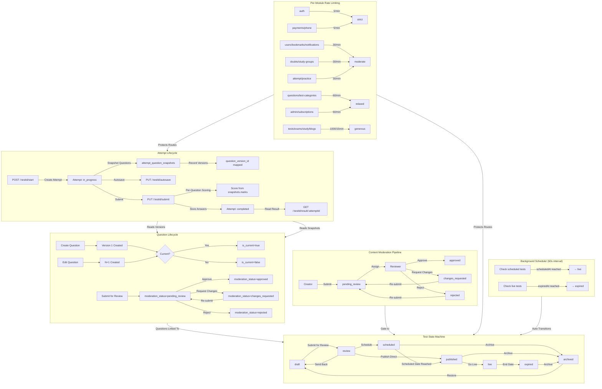
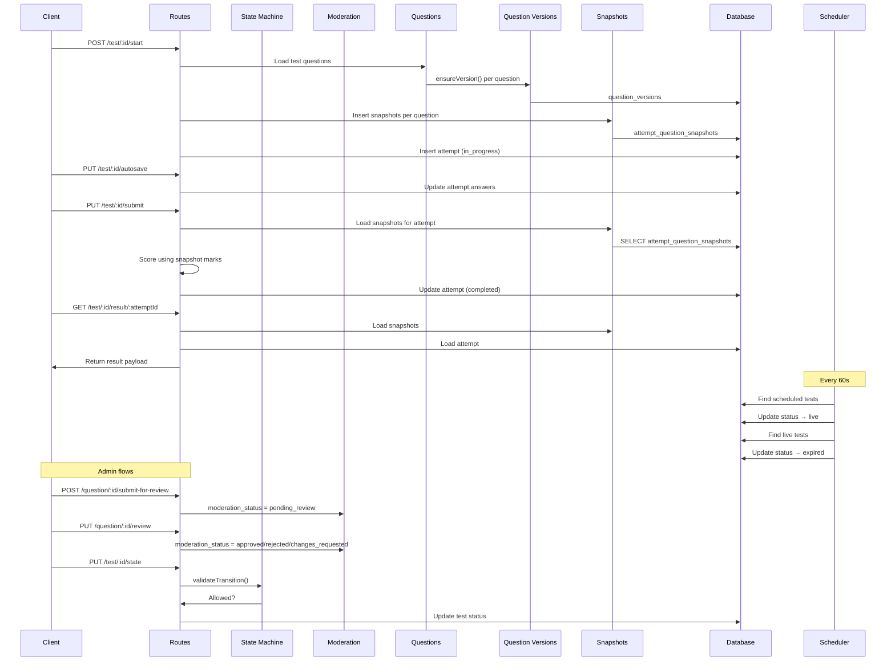
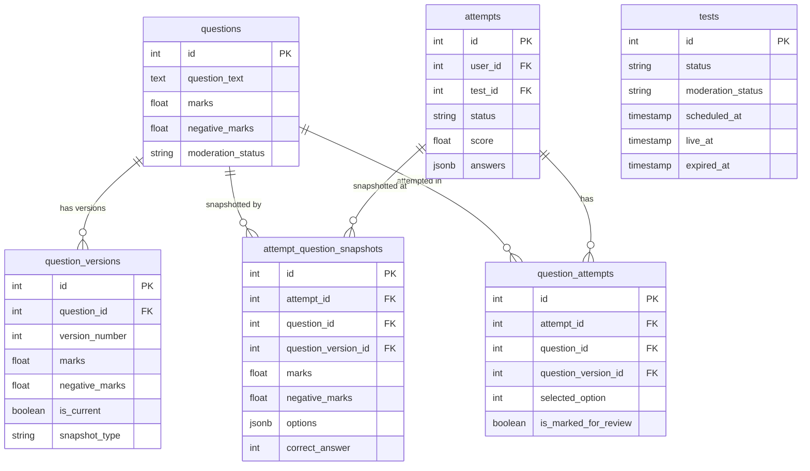

# Phase 1 Workflow Map



## Data Flow



## Table Relationships



## Migration Order

```
019 → 020 → 021 → 022 → 023
│      │      │      │      │
│      │      │      │      └─ Content moderation columns
│      │      │      └──────── Test state machine columns + indexes
│      │      └─────────────── Attempt question snapshots table
│      └────────────────────── Question versioning enhancements
└──────────────────────────── Base schema fixes
```
