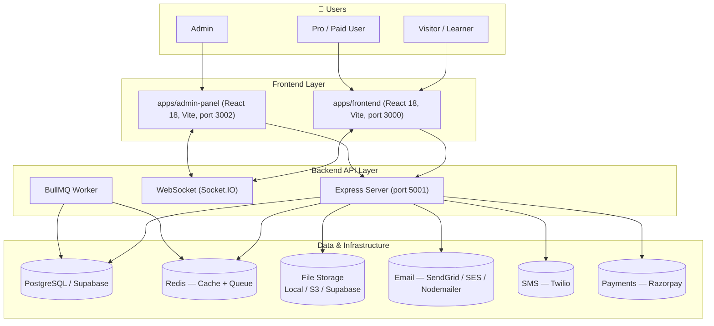
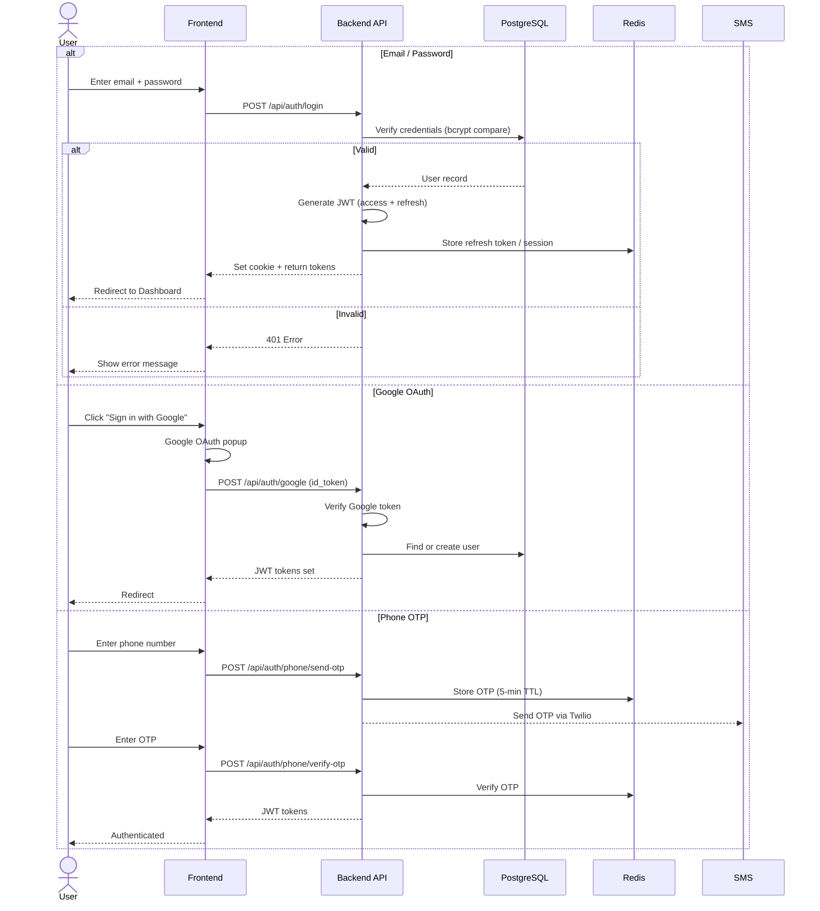
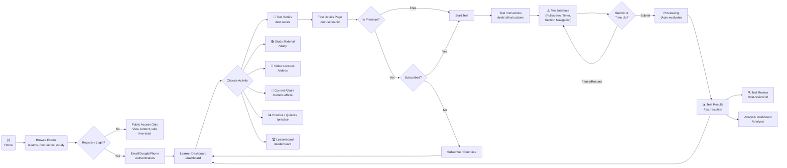
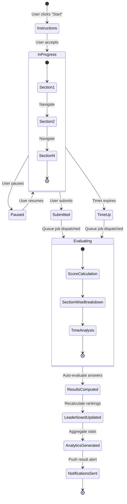
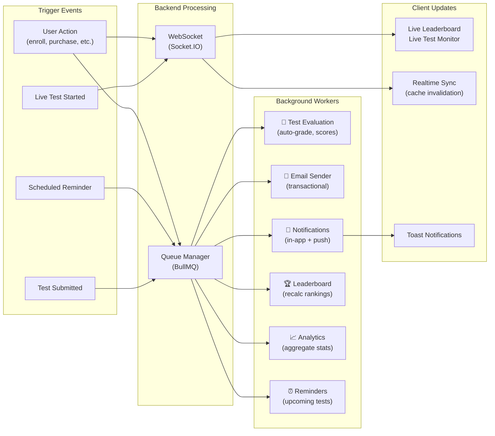
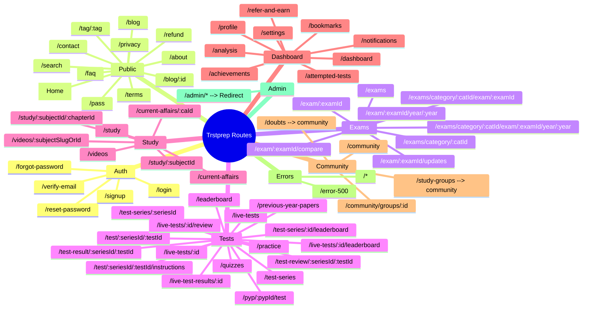
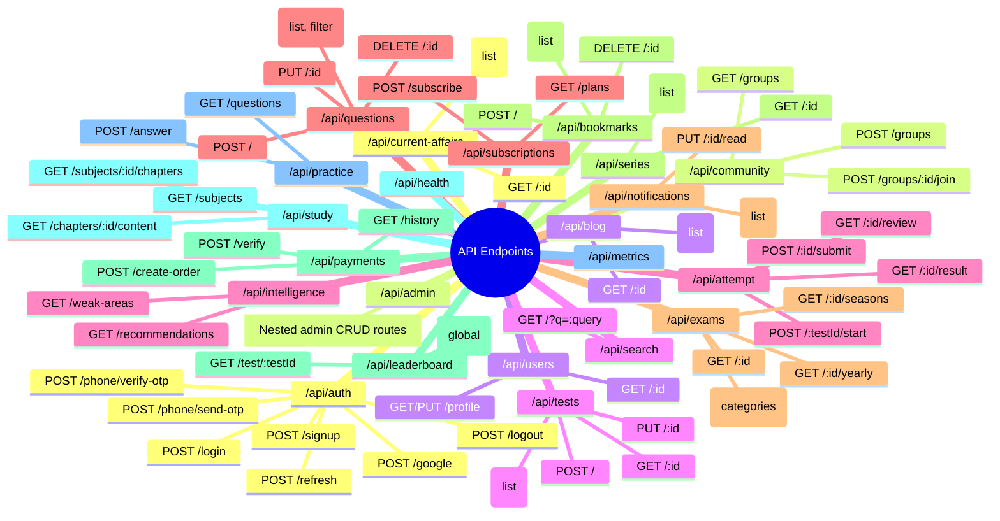

# Trstprep Platform — Workflow Chart Map

## 1. System Architecture

---

## 2. Authentication & Session Flow

---

## 3. Learner User Journey

---

## 4. Test Attempt Lifecycle (Backend Detail)

---

## 5. Backend Request Processing Pipeline

```mermaid
flowchart LR
    REQ["HTTP Request"] --> H1

    subgraph MW["Middleware Pipeline (in order)"]
        H1["1️⃣ Helmet<br/>(Security Headers)"]
        CORS["2️⃣ CORS<br/>(Origin Allowlist)"]
        RL["3️⃣ Rate Limiter<br/>(3 tiers)"]
        CP["4️⃣ Cookie Parser"]
        MG["5️⃣ Morgan<br/>(Request Logging)"]
        MON["6️⃣ Monitoring<br/>(Timing Metrics)"]
        PID["7️⃣ Public ID<br/>(ID transform)"]
        CC["8️⃣ Cache Control"]
        AUTH["9️⃣ Auth Middleware<br/>(optionalAuth / protect / admin)"]
        CSRF["🔟 CSRF Middleware<br/>(Mutations only)"]
        VAL["1️⃣1️⃣ Validation<br/>(Joi schemas)"]
    end

    subgraph Handler["Route Handler"]
        DIR["Controller Layer"]
        SVC["Service Layer"]
        REPO["dbHelpers / Repository"]
    end

    subgraph Response["Response"]
        RES["JSON Response"]
    end

    REQ --> H1
    H1 --> CORS
    CORS --> RL
    RL --> CP
    CP --> MG
    MG --> MON
    MON --> PID
    PID --> CC
    CC --> AUTH
    AUTH --> CSRF
    CSRF --> VAL
    VAL --> DIR
    DIR --> SVC
    SVC --> REPO
    REPO --> RES
```

---

## 6. Admin Panel Workflow

```mermaid
flowchart TB
    subgraph AdminAuth["Authentication"]
        AL["/admin/login"] --> ADASH
    end

    ADASH["/admin Dashboard"] --> ASEL{"Select Module"}

    ASEL --> ASSESS["📝 Assessments"]
    ASEL --> EXAM["📋 Exams & Categories"]
    ASEL --> STUDY["📚 Study Materials"]
    ASEL --> USERS["👥 Users"]
    ASEL --> ANALYTICS["📊 Analytics"]
    ASEL --> NOTIF["🔔 Notifications"]
    ASEL --> SUB["💳 Subscriptions"]
    ASEL --> SYS["⚙️ System Settings"]

    ASSESS --> QMAN["Manage Questions<br/>CRUD, Bulk Import"]
    ASSESS --> TMAN["Manage Tests<br/>Create, Configure"]
    ASSESS --> SSEC["Manage Sections<br/>Timing, Questions"]
    ASSESS --> SERIES["Test Series Admin"]

    EXAM --> CAT["Exam Categories"]
    EXAM --> INFO["Exam Info / Seasons"]
    EXAM --> STG["Stages"]

    STUDY --> SUBJ["Subjects"]
    STUDY --> TOP["Topics / Chapters"]
    STUDY --> VID["Videos"]
    STUDY --> CA["Current Affairs"]

    USERS --> ULIST["User List"]
    USERS --> ENRL["Enrollments"]
    USERS --> ROLES["Roles & Permissions"]

    ANALYTICS --> DA["Deep Analytics"]
    ANALYTICS --> LB["Leaderboards"]
    ANALYTICS --> AUDIT["Audit Trail"]

    NOTIF --> NMAN["Push Notifications"]
    NOTIF --> BANNER["Banners"]
    NOTIF --> FAQ["FAQs"]

    SUB --> PLANS["Subscription Plans"]
    SUB --> COUPONS["Coupons"]
    SUB --> PROMO["Promotions"]

    SYS --> SETT["Platform Settings"]
    SYS --> BACKUP["Backups"]
    SYS --> SESS["Active Sessions"]
    SYS --> BIN["Recycle Bin"]
```

---

## 7. Real-Time & Background Job Flow

---

## 8. Complete Route Map

---

## 9. API Route Map (Backend)

