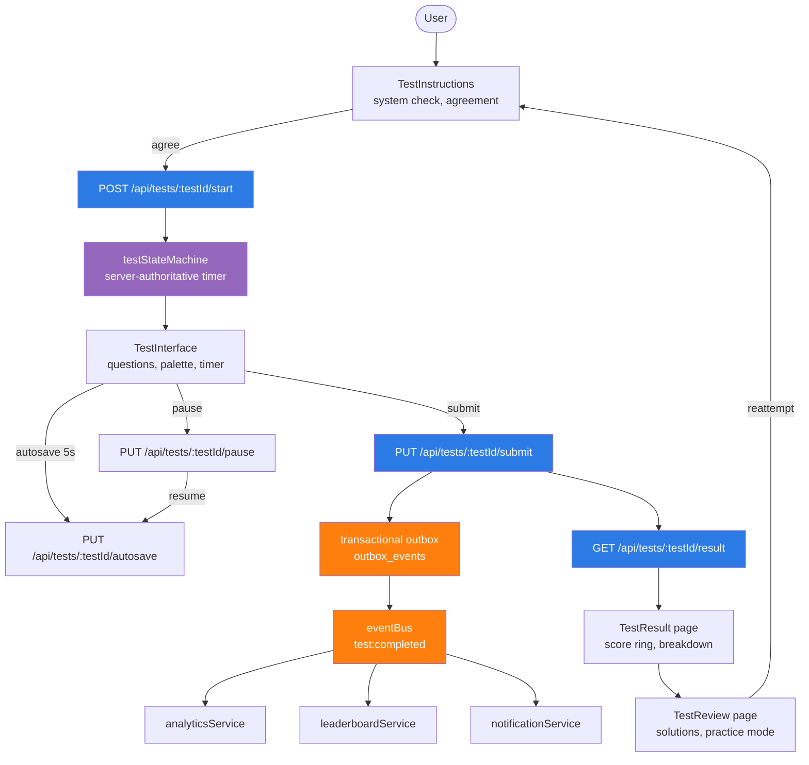
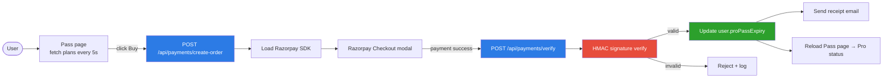
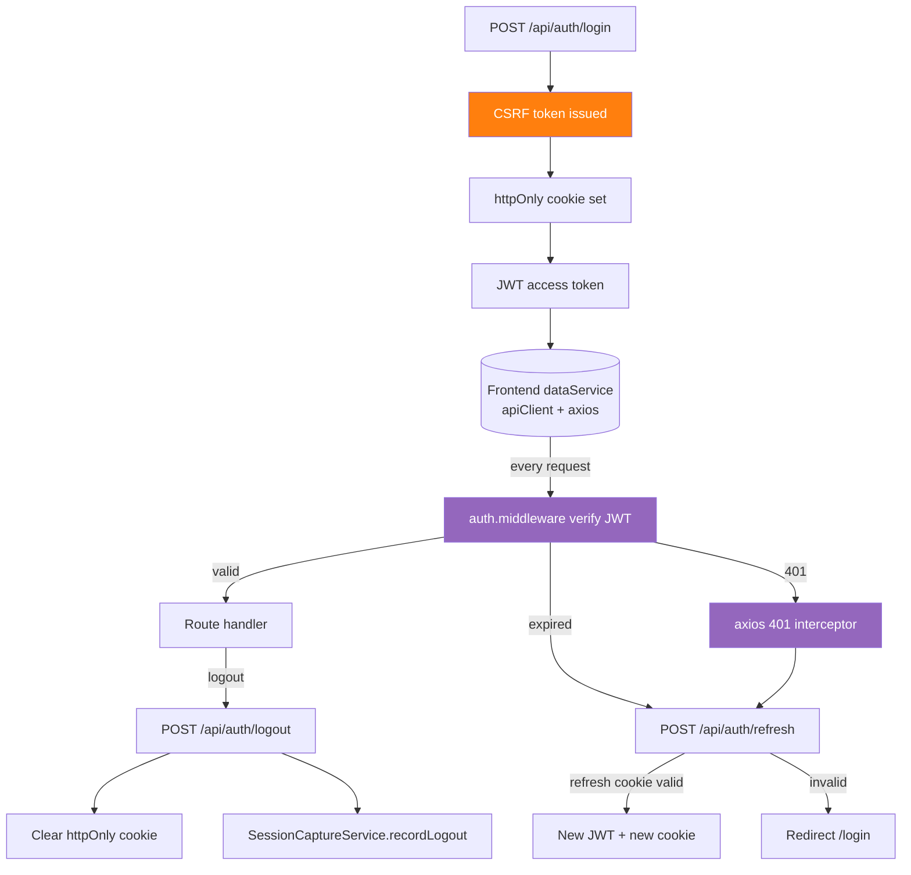
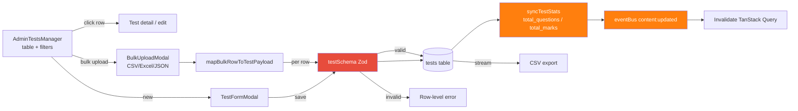
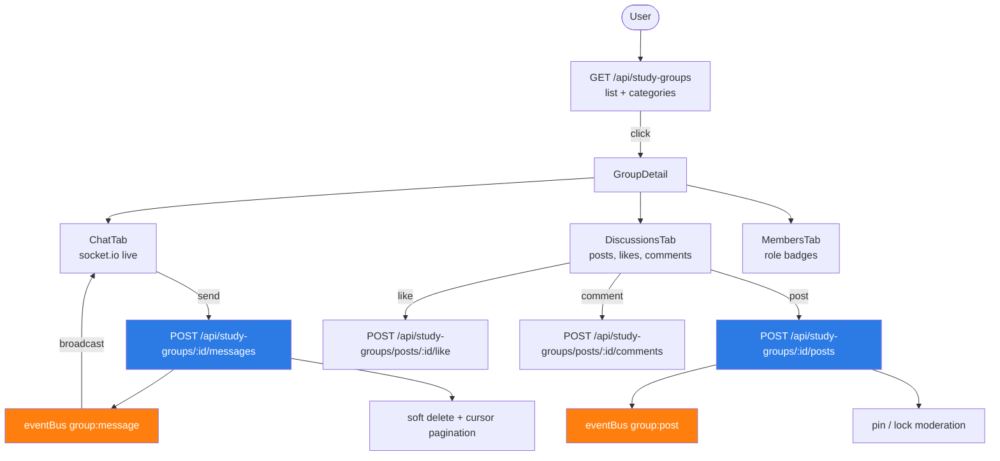
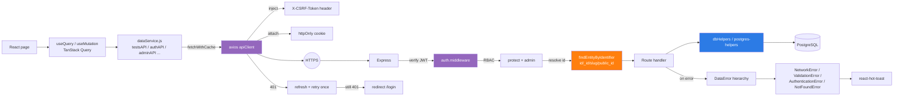
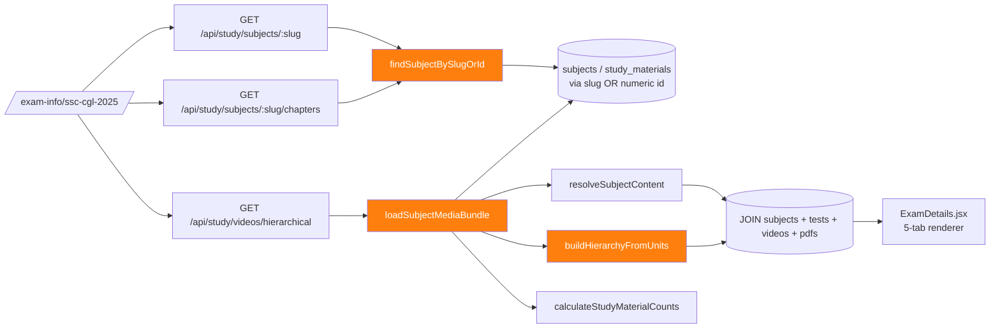
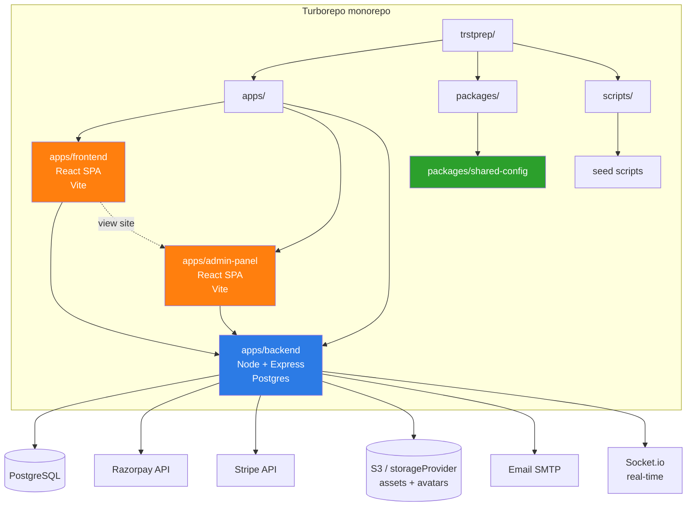

# Trstprep V2.1 — Workflow / Flow Map

Visual map of the main request, data, and decision flows extracted from the audit graph.

---

## 1. Test Attempt Lifecycle (the core user journey)

---

## 2. Pro Pass / Razorpay Purchase

---

## 3. Auth & Session Flow

---

## 4. Admin Test CRUD pattern (the admin idiom)

---

## 5. Community (Study Groups) flow

---

## 6. Data Service request path (every frontend call)

---

## 7. Public routing (slug-first) for study content

---

## 8. Monorepo deployment topology

---

## Legend

| Color | Meaning |
|---|---|
| Blue (`#2c7be5`) | Backend HTTP route / API endpoint |
| Orange (`#ff7f0e`) | Cross-cutting concern (event bus, ID resolution, schema sync) |
| Purple (`#9467bd`) | Cross-cutting middleware / interceptor |
| Green (`#2ca02c`) | State / persistence transition |
| Red (`#e74c3c`) | Validation / security gate |
