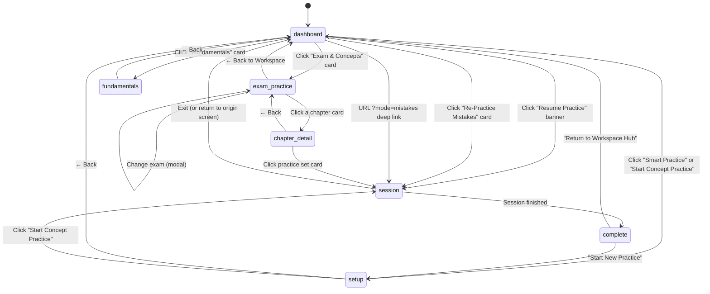
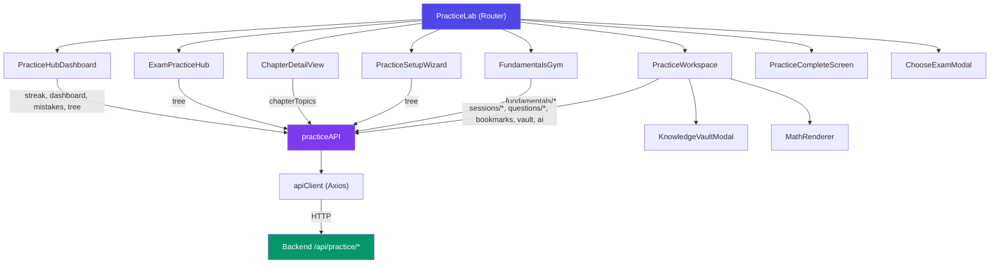
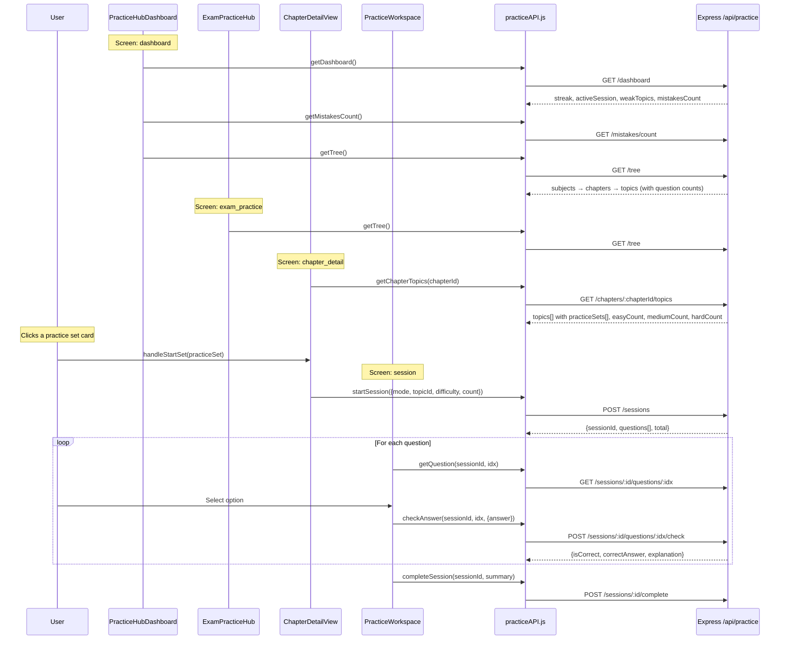
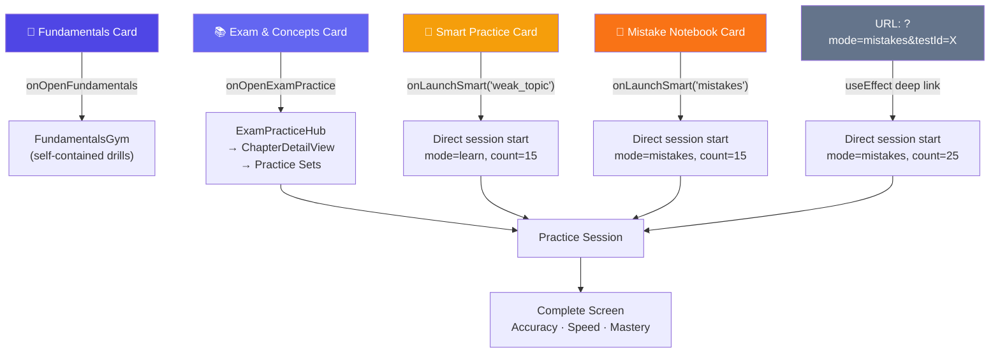

# Practice Lab — Full Workflow & Architecture

## Screen State Machine

The entire Practice Lab is a single-page state machine driven by `screen` state in [`PracticeLab.jsx`](file:///e:/Tech/Testprep/Trstprep%20V2.1/apps/frontend/src/pages/tests/PracticeLab.jsx).

---

## 7 Screens at a Glance

| #   | Screen ID        | Component                | Purpose                                                                                                           |
| --- | ---------------- | ------------------------ | ----------------------------------------------------------------------------------------------------------------- |
| 1   | `dashboard`      | `PracticeHubDashboard`   | 4-card hub: Fundamentals, Exam Practice, Smart AI, Mistake Notebook + streak + resume banner + recommended topics |
| 2   | `exam_practice`  | `ExamPracticeHub`        | Two-column: subjects sidebar ↔ chapters grid + Upgrade Pass banner (conditional)                                  |
| 3   | `chapter_detail` | `ChapterDetailView`      | Two-column: topics sidebar ↔ practice set cards (Quick/Easy/Medium/Hard/Full)                                     |
| 4   | `setup`          | `PracticeSetupWizard`    | Manual config: Subject → Chapter → Topic → Difficulty → Question count → Start                                    |
| 5   | `fundamentals`   | `FundamentalsGym`        | Calculation drills: Tables, Squares, Cubes, Roots, Fractions, Ratios, Triplets                                    |
| 6   | `session`        | `PracticeWorkspace`      | Active question-by-question practice with answer checking, explanations, AI tutor                                 |
| 7   | `complete`       | `PracticeCompleteScreen` | Summary: Accuracy, Avg Speed, Concept Mastery + "Start New" / "Return"                                            |

---

## Component Tree

---

## API Data Flow (Frontend → Backend)

---

## Full Backend API Surface (38 endpoints)

### Core Navigation

| Method | Endpoint                      | Used By                         |
| ------ | ----------------------------- | ------------------------------- |
| `GET`  | `/tree`                       | Dashboard, ExamHub, SetupWizard |
| `GET`  | `/subjects`                   | SetupWizard                     |
| `GET`  | `/chapters/:chapterId/topics` | ChapterDetailView               |
| `GET`  | `/topics/:topicId/stats`      | (unused in current UI)          |
| `GET`  | `/dashboard`                  | Dashboard                       |

### Sessions

| Method  | Endpoint                 | Used By                               |
| ------- | ------------------------ | ------------------------------------- |
| `POST`  | `/sessions`              | Start any practice (all entry points) |
| `GET`   | `/sessions/active`       | Dashboard resume banner               |
| `GET`   | `/sessions/:id`          | Resume from dashboard                 |
| `PATCH` | `/sessions/:id`          | Update progress                       |
| `POST`  | `/sessions/:id/complete` | End session → complete screen         |

### Questions (during session)

| Method | Endpoint                                | Used By              |
| ------ | --------------------------------------- | -------------------- |
| `GET`  | `/sessions/:id/questions/:idx`          | PracticeWorkspace    |
| `POST` | `/sessions/:id/questions/:idx/check`    | Answer checking      |
| `POST` | `/sessions/:id/questions/:idx/skip`     | Skip question        |
| `GET`  | `/questions/:id/explanations`           | Learning panel       |
| `GET`  | `/questions/:id/approaches`             | Community approaches |
| `POST` | `/questions/:id/approaches`             | Submit approach      |
| `POST` | `/questions/:id/approaches/:aid/upvote` | Upvote               |
| `GET`  | `/questions/:id/similar`                | Similar questions    |

### Bookmarks & Mistakes

| Method   | Endpoint                 | Used By                 |
| -------- | ------------------------ | ----------------------- |
| `GET`    | `/bookmarks`             | Bookmarks page          |
| `GET`    | `/bookmarks/count`       | (future)                |
| `POST`   | `/bookmarks/:questionId` | Bookmark during session |
| `DELETE` | `/bookmarks/:questionId` | Unbookmark              |
| `GET`    | `/mistakes`              | Mistake notebook        |
| `GET`    | `/mistakes/count`        | Dashboard mistake card  |

### Fundamentals Gym

| Method | Endpoint                   | Used By              |
| ------ | -------------------------- | -------------------- |
| `GET`  | `/fundamentals/categories` | FundamentalsGym      |
| `GET`  | `/fundamentals/drill`      | Start drill          |
| `POST` | `/fundamentals/submit`     | Submit drill results |

### AI & Vault

| Method | Endpoint                | Used By                 |
| ------ | ----------------------- | ----------------------- |
| `POST` | `/ai/tutor`             | AI tutor in Workspace   |
| `POST` | `/vault/save`           | Save to knowledge vault |
| `GET`  | `/vault/items`          | View vault              |
| `POST` | `/questions/:id/report` | Report question         |

### Admin

| Method | Endpoint                    |
| ------ | --------------------------- |
| `GET`  | `/reports/my`               |
| `GET`  | `/reports/admin/all`        |
| `PUT`  | `/reports/admin/:id/status` |
| `GET`  | `/bookmarks/admin/all`      |
| `GET`  | `/questions`                |
| `GET`  | `/questions/:id`            |
| `POST` | `/adaptive-diagnostic`      |

---

## Practice Set Generation (The Bottleneck You Asked About)

```mermaid
flowchart LR
    subgraph Backend["Backend: practice.js L662–738"]
        PS["PRACTICE_SETS constant<br/>Quick(10), Easy(15),<br/>Medium(15), Hard(10),<br/>Full(ALL)"]
        MAP["Map each set → topic<br/>count = min(set.count, available)<br/>Full → available"]
        FILTER["Filter: count > 0"]
        PS --> MAP --> FILTER
    end

    subgraph Frontend["Frontend: PracticeLab.jsx L719–744"]
        GAS["getAvailableSets(topic)"]
        STYLES["Apply practiceSetStyles<br/>indigo/emerald/amber/red/purple"]
        CARDS["Render practice set cards"]
        GAS --> STYLES --> CARDS
    end

    subgraph Session["Session Creation"]
        START["handleStartSet(ps)<br/>→ onStartSession(config)"]
        API["POST /api/practice/sessions<br/>count capped at 200"]
        START --> API
    end

    FILTER --> GAS
    CARDS -->|"Click"| START
```

---

## 5 User Entry Points into Practice

---

## Database Tables Involved

| Table                            | Purpose                                                                                          |
| -------------------------------- | ------------------------------------------------------------------------------------------------ |
| `questions`                      | Master question bank (filtered by `PRACTICE_Q_WHERE`)                                            |
| `practice_sessions`              | Session state: user_id, mode, difficulty, target_count, questions_json, current_index, is_active |
| `practice_answers`               | Per-question answer records (correct/wrong/skipped)                                              |
| `practice_bookmarks`             | Bookmarked questions                                                                             |
| `practice_ai_cache`              | AI explanation/approach cache                                                                    |
| `question_reports`               | Reported questions                                                                               |
| `practice_fundamentals_results`  | Drill results                                                                                    |
| `knowledge_vault_items`          | Saved concepts                                                                                   |
| `subjects`, `chapters`, `topics` | Curriculum taxonomy tree                                                                         |

---

## Key Files

| Layer          | File                                                                                                                               | Lines | Purpose                                     |
| -------------- | ---------------------------------------------------------------------------------------------------------------------------------- | ----- | ------------------------------------------- |
| **Page**       | [`PracticeLab.jsx`](file:///e:/Tech/Testprep/Trstprep%20V2.1/apps/frontend/src/pages/tests/PracticeLab.jsx)                        | 1704  | 7-screen state machine, 5 inline components |
| **Component**  | [`PracticeWorkspace.jsx`](file:///e:/Tech/Testprep/Trstprep%20V2.1/apps/frontend/src/pages/tests/components/PracticeWorkspace.jsx) | 814   | Active session Q&A + learning panel         |
| **Component**  | [`FundamentalsGym.jsx`](file:///e:/Tech/Testprep/Trstprep%20V2.1/apps/frontend/src/pages/tests/components/FundamentalsGym.jsx)     | 1799  | Calculation drills                          |
| **API Client** | [`practiceAPI.js`](file:///e:/Tech/Testprep/Trstprep%20V2.1/apps/frontend/src/shared/lib/practiceAPI.js)                           | 159   | 25 API methods                              |
| **Backend**    | [`practice.js`](file:///e:/Tech/Testprep/Trstprep%20V2.1/apps/backend/src/api/routes/practice.js)                                  | 2584  | 38 endpoints                                |
| **Hook**       | [`useProPass.js`](file:///e:/Tech/Testprep/Trstprep%20V2.1/apps/frontend/src/shared/hooks/useProPass.js)                           | 202   | Pro pass gating                             |

---

## Enhancement Opportunities

> [!TIP]
> These are areas identified from the workflow analysis for potential improvement.

| Area                                    | Current State                                           | Enhancement Idea                                                                             |
| --------------------------------------- | ------------------------------------------------------- | -------------------------------------------------------------------------------------------- |
| **PracticeLab.jsx is 1704 lines**       | 5 components inline + main router                       | Extract `ExamPracticeHub`, `ChapterDetailView`, `PracticeCompleteScreen` into separate files |
| **Practice sets are static**            | 5 hardcoded sets: Quick/Easy/Medium/Hard/Full           | Dynamic sets based on topic size (e.g. "Marathon 100", "Sprint 5")                           |
| **No pagination for Full Practice**     | Session capped at 200 questions server-side             | Add "Continue" to spawn sequential sessions for large topics                                 |
| **Setup Wizard redundant?**             | Separate screen duplicates ChapterDetailView's function | Merge into ChapterDetailView or remove                                                       |
| **FundamentalsGym is 1799 lines**       | Monolithic component                                    | Extract drill types into sub-components                                                      |
| **No progress persistence mid-session** | `currentIndex` tracked but no periodic sync             | Auto-save progress every N questions                                                         |
| **Weak topic recommendations**          | Only 4 shown on dashboard                               | Expand into a dedicated "AI Study Plan" section                                              |
| **No practice history**                 | No "past sessions" view                                 | Add session history with re-attempt capability                                               |
| **Upgrade banner**                      | Now conditional ✅                                      | Add pricing/plan link + trial CTA                                                            |
| **Deep link only for mistakes**         | `?mode=mistakes&testId=X`                               | Support `?mode=topic&topicId=X` for sharing                                                  |
